# adaptive-udp-link
- **概要**
Cによる通信処理の実装練習と、通信性能・障害検知・欠落回復・リアルタイム性の検証をまとめたリポジトリです。Raspberry Pi 5上のUDP loopback、Pi 5–Pico間のUART実機通信、Pico上のFreeRTOSを対象に検証しています。
- **課題と展望**
各領域について基本的な実装と実機評価まで行ったものの、Adaptive Rateでは送信rateを下げすぎる、Retransmitでは遅延が増える、XOR FECでは複数欠落を回復できないといった課題が残っています。今後は、これらの制御・回復方式を改善し、FreeRTOS上でのリアルタイム処理も含めて発展させる予定です。

| 検証領域                                          | 検証技術                                                | 実測結果                                                                                     | 次の一手                               |
| --------------------------------------------- | --------------------------------------------------- | ---------------------------------------------------------------------------------------- | ---------------------------------- |
| Pi 5–Pico間のUART実機通信で、packet通信が成立するかを検証        | UART、packet parser、CRC、ACK、telemetry                | 10 packetを全数受理し、CRC error 0、payload完全一致10/10を確認                                          | 通信制御をPi 5–Pico実機通信へ拡張          |
| Pi 5のUDP loopbackで、送信条件によるpacket欠落と通信遅延の変化を検証 | UDP、POSIX socket、送信レート、socket buffer制御、CPU affinity | 120 kHzまでは欠落0、500 kHzでは欠落2.37%、P99遅延0.410 ms。buffer増加で欠落は減少したが通信遅延が増え、高負荷時の欠落はCPU固定後も残った | 欠落と遅延を両立できる送信条件を探索             |
| Pi 5のUDP loopbackで、通信障害の検知と欠落回復方式の効果を検証       | FSM、feedback、Adaptive Rate、再送、XOR FEC               | 3秒停止をFSMで検知して復帰を確認。Adaptive Rateは欠落率を2.8919%から2.7661%へ改善、再送は実効欠落を45.7%、XOR FECは約73%削減    | Adaptive Rate・再送・FEC・FSMを改善・統合 |
| Pico上で、実行構成による周期送信の時間ずれの違いを検証                 | Bare-metal、FreeRTOS、task優先度、jitter計測                | 同一RX負荷で、TX jitter P99がBare-metalの1,839 µsからFreeRTOSでは0 µsとなり、deadline missも0件だった         | 通信制御をFreeRTOS taskとして実装・評価     |


## 検証したことと結果

### 1. Pi 5–Pico UART実機通信

**目的**：Pi 5–Pico間のUART実機通信で、自作packet format（preamble、version、type、sequence、length、CRC-32）によるpacket通信が正しく成立することを検証する。
**実験方法**：packet formatを仕様として先に固定し、PC harness（Python）とMCU parser（C）を独立に実装。Pi 5からUART経由でDATA packetを送信し、PicoはACKを返しつつtelemetryをUSB CDCへ出力する。PC側の送受信ログとMCU内部カウンタを同一trialのCSVに保存し、突き合わせて判定する。判定はPC側の受信数ではなくMCU内部の`rx_data_count`を採用（`pass_fail=PASS`、`final_state=RUN`）。

#### 1-1. 実機bring-upでの故障切り分け

- **やったこと**：初回接続時に通信が成立せず、PC側UART・ジャンパ線・firmware動作・MCUピンを1要素ずつ検証。最終的にPico単体で`GP0`と`GP1`を直結する自己ループバック試験を実施。
- **現象**：Picoのループバックでも、HEARTBEATを11,000 byte以上送出しているのに1 byteも受信しなかったため、故障をPico側ピンに限定。`GP12`/`GP13`では同じ検証を行って成立。
- **示唆**：おそらくピンの接続不良だと思われる。Picoのピンは自前ではんだ付けしているが、はんだ付けしたらちゃんと動作確認する必要あり。

```text
# uart0 tx=GP12 rx=GP13 baudrate=115200 heartbeat_ms=0
```

#### 1-2. packet通信の実機成立とMCU内部状態の突き合わせ

- **やったこと**：MCU側で受信packet数、ACK送信数、CRC error、sequence gap、preamble不一致などのtelemetryを取得し、Pi 5側の送受信結果と突き合わせた。
- **現象**：想定されるUART受信量は320 byteだったが、実測では321 byteだった。正常DATA packetは10 packetすべて受理され、preamble不一致以外のエラーのカウンタ（CRC error、sequence gap、duplicate、buffer overflow）は0だった。一方、余分な1 byteはpreambleに一致せず、preamble_miss_count=1として記録された。

| カウンタ                | 実測値 |
| ------------------- | --: |
| UART受信byte数         | 321 |
| 正常packet受信数         |  10 |
| DATA packet受信数      |  10 |
| ACK送信数              |  10 |
| CRC error数          |   0 |
| sequence欠落数         |   0 |
| duplicate数          |   0 |
| preamble不一致byte数    |   1 |
| RX buffer overflow数 |   0 |
| RX buffer miss数     |   0 |


- **示唆**：超過した1 byteは、電源投入直後にRXラインが浮いていた区間で混入したノイズと考えらる。単純なUART通信でも、送っていない超過1 byteがノイズとして混入しまうので、網羅的な観点でカウンタを入れてデバッグ・想定外の現象の原因特定できるようにする必要がある。

**実測条件**：Pi 5 `/dev/ttyAMA2`（`dtoverlay=uart2-pi5`, GPIO4/5）、Pico `GP12`/`GP13`、115200 8N1、payload 16 byte。既定の`/dev/ttyAMA0`とPico `GP0`/`GP1`はこの個体では機能せず、代替ピンを実測で選定した。

関連資料: [実機baseline](data/mcu_uart/m0_baseline_001/)、[bring-up切り分け手順](docs/mcu_uart/link_bringup_triage.md)、[packet仕様](docs/mcu_uart/protocol.md)、[PC harness](scripts/mcu_uart/pc_harness.py)、[MCU parser](firmware/mcu_uart_link/mcu_uart_protocol.c)。

### 2. Pi 5 loopbackでのUDP性能評価

**目的**：Pi 5のUDP loopbackで、送信条件（送信レート、socket bufferサイズ、CPU affinity）によってpacket欠落と通信遅延がどう変わるかを検証する。

**実験方法**：正常時の再現性 → 負荷限界（送信レート） → 処理資源（socket buffer、CPU affinity）の順に、条件を1つずつ変えてpacket欠落と通信遅延を計測し、３回の平均を結果とする。物理ネットワークやMCU処理の影響を分離するため、loopback経路で計測する。

#### 2-1. 送信レートを上げたときの限界測定

- **やったこと**：50 Hz〜1 MHzで送信し、欠落、CPU、P95/P99/最大遅延を測定。
- **現象**：
  - packet欠落:120 kHzまでは欠落なし。140 kHzから欠落あり、500 kHzでは欠落率2.37%、P99遅延0.410 msと想定通り送信レートが早すぎると処理遅れ、バッファーからの漏れが出始め欠落が出始める。
  - 遅延:想定では送信レートが早くなるほど処理が追い付かないため、遅延は大きくなる想定だったが、欠落があるまでは送信レートを上げるほどP99遅延はむしろ下がった。
- **示唆**：
  - 処理の限界は遅延悪化よりpacke欠落として現れるため、欠落と遅延を同時に見る必要がある。
  - 低レートで遅延が大きくなるのは、poll()で受信待ちのsleepに入り、packet到着後の起床・scheduling待ちが遅延に加わるためと考えている。
- **次の一手**：
  - poll()でsleepせず、受信データの有無をCPU上で繰り返し確認する方式と比較することで、sleep復帰の影響を切り分けられる見込み。

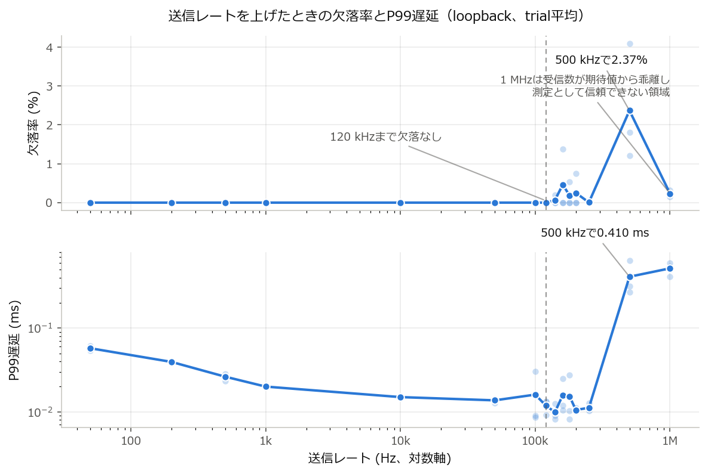

#### 2-2. socket buffer比較

- **やったこと**：送信レート、受信バッファサイズ（`SO_RCVBUF`）、送信バッファサイズ（`SO_SNDBUF`）の3軸を変化させ、packet欠落と遅延への影響を測定。
- **現象**：
  - バッファーの要求値と実行値：また`setsockopt`で要求した値がそのまま使われるわけではなく、実際には要求値の2倍が確保され、小さすぎる要求は下限値に丸められた（送信バッファで2,000→4,608 byte。図の目盛は要求値/実効値）
  - 送信レートと受信バッファー：~200k[Hz]までは受信バッファ減少でpacket欠落が大きく増える箇所あり。200k[Hz]~だと、今回計測した受信バッファーの範囲では対応できず最大の受信バーでも変わらず欠落が大きい。また、180~200k[Hz]だと、packet欠落を受信バッファーを増やしたことでカバーした分queue滞留によりP95/P99/最大遅延が増えていることを確認。
  - 送信バッファ×受信バッファ：送信バッファ×受信バッファ：両方の容量を大きくするほど欠落が減る想定だったが、実際には欠落数に単調な傾向は見られず、今回の測定範囲では送受信バッファ容量と欠落数の明確な関係は確認できなかった。
- **示唆**：180〜200 kHzの一部条件では、受信バッファを増やすことでpacket欠落が減る一方、P95/P99/最大遅延が増加した。この範囲では、欠落抑制と遅延の間にトレードオフが生じる可能性がある。また、socket bufferは要求値と実効値が異なるため、評価時には実効値を確認する必要がある。
  
 

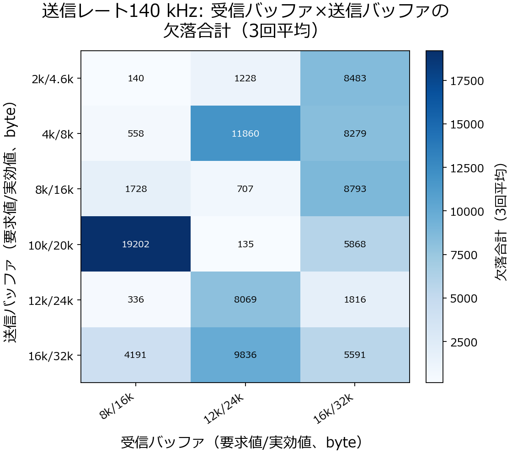 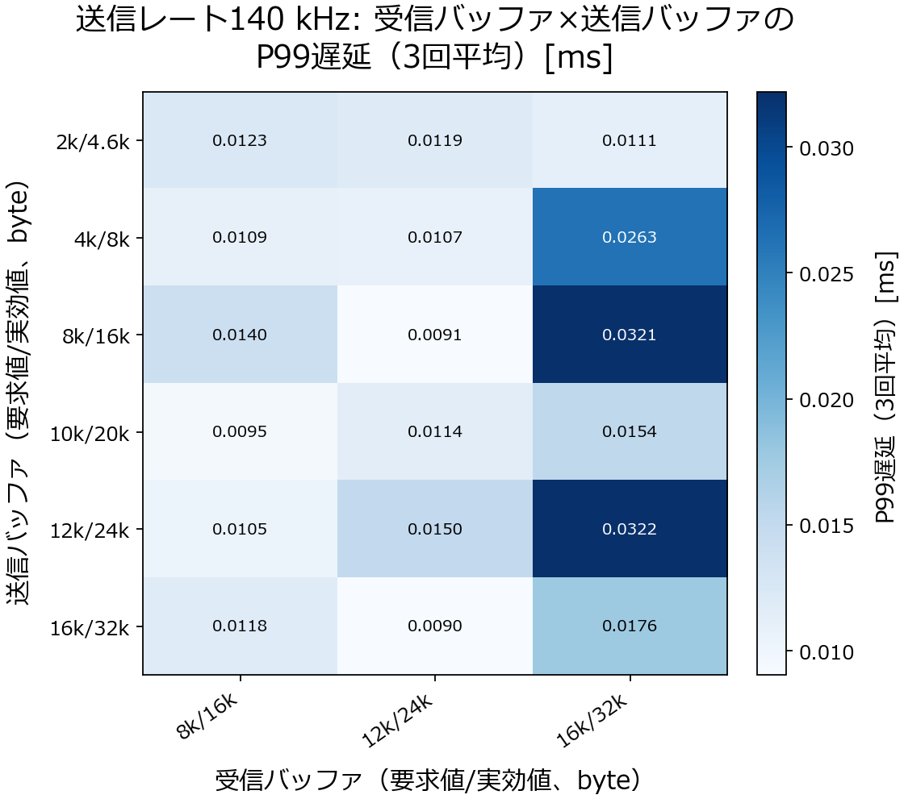

<details>
<summary>その他の計測グラフ（socket buffer比較）</summary>

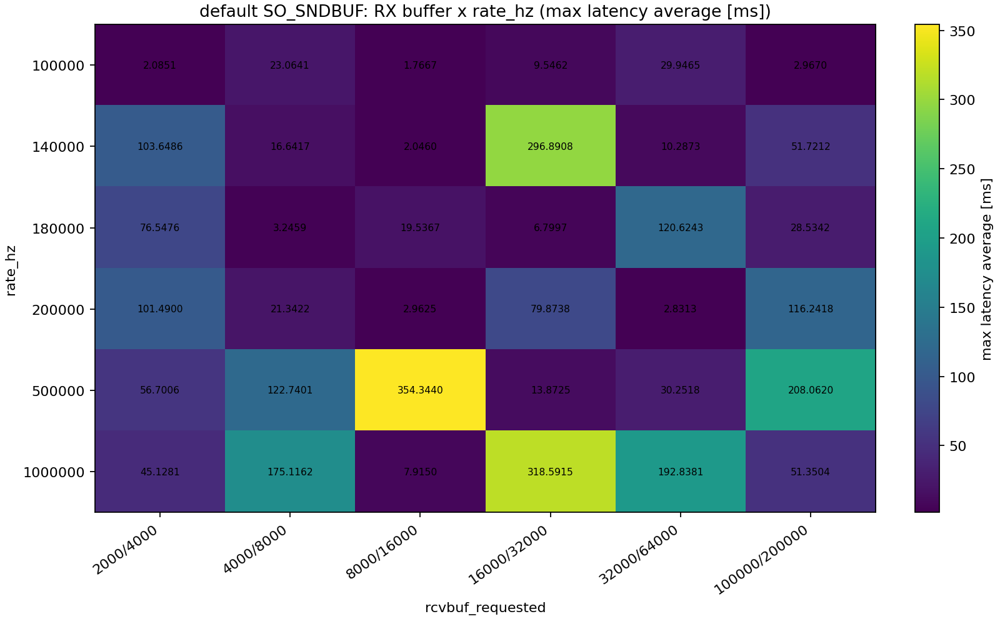

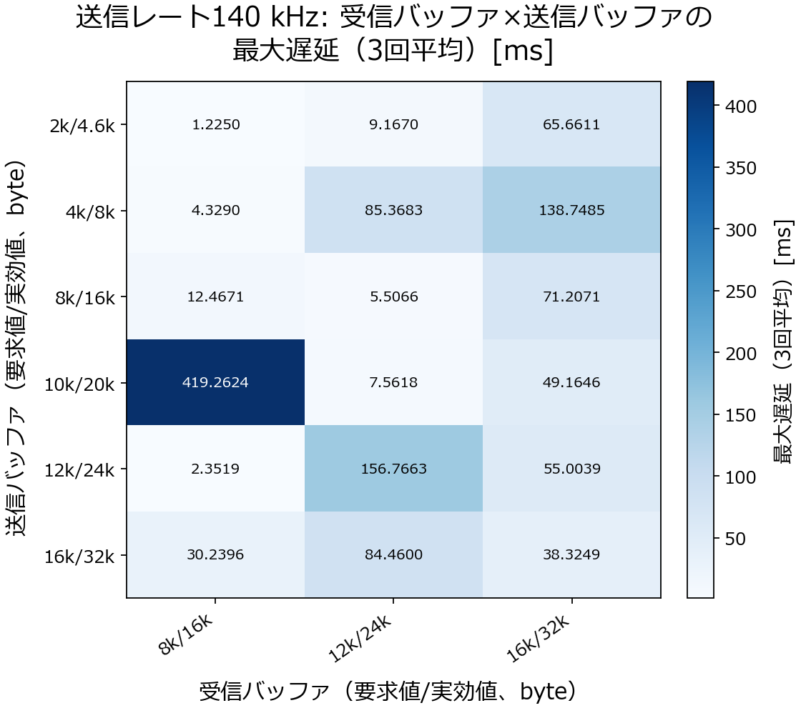

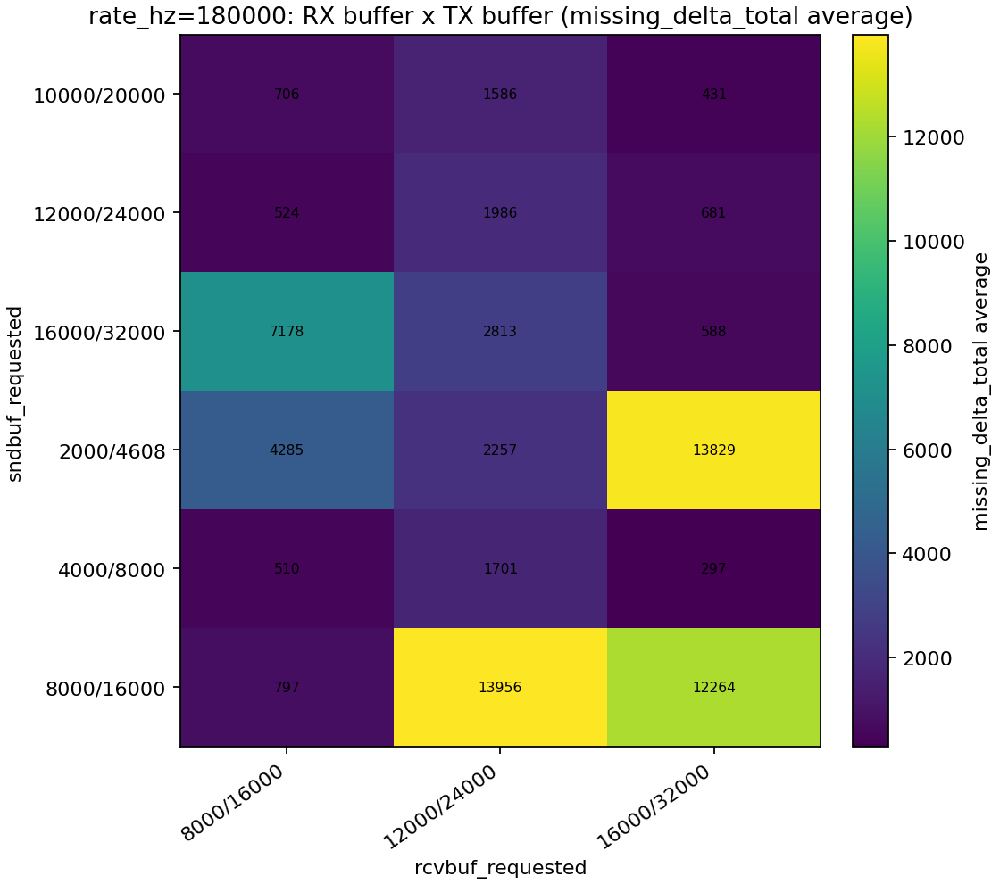

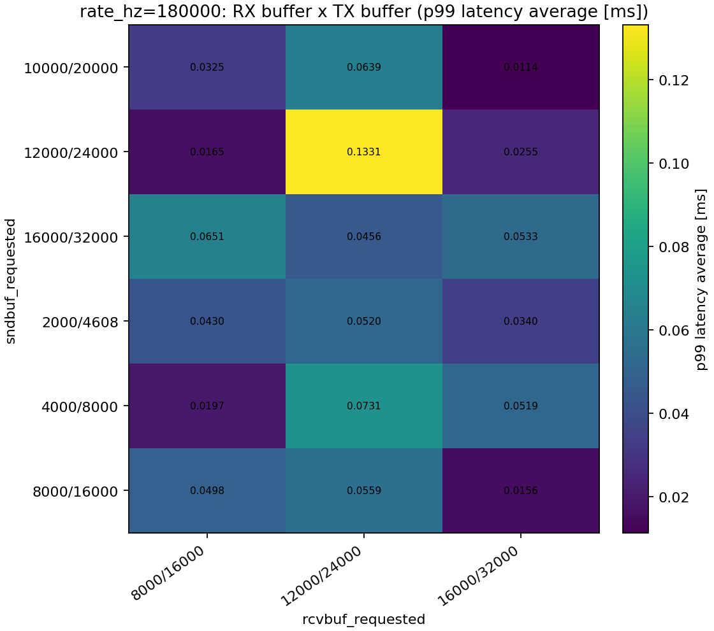

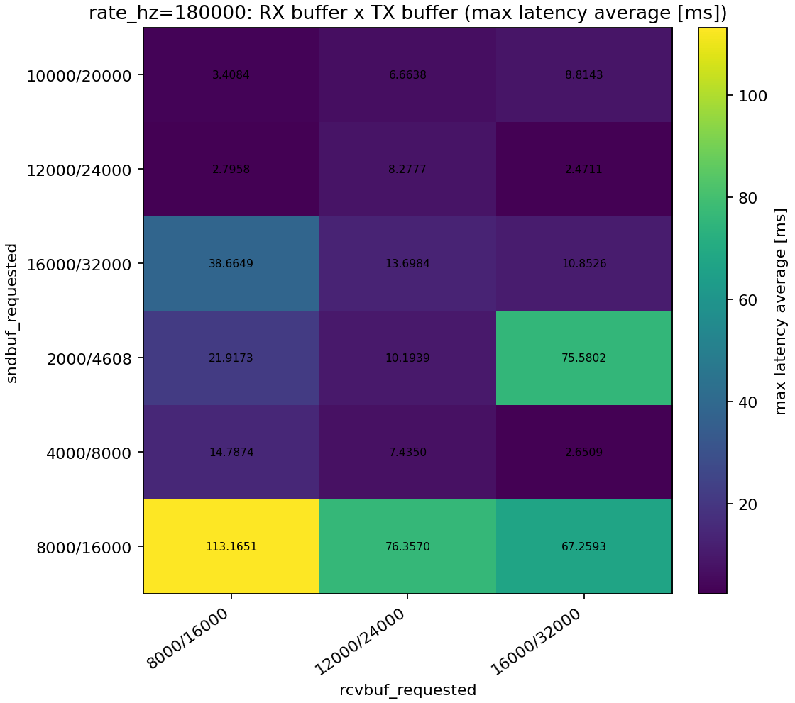

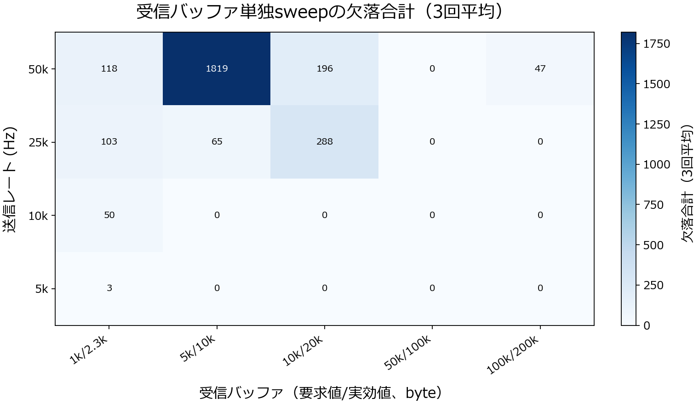

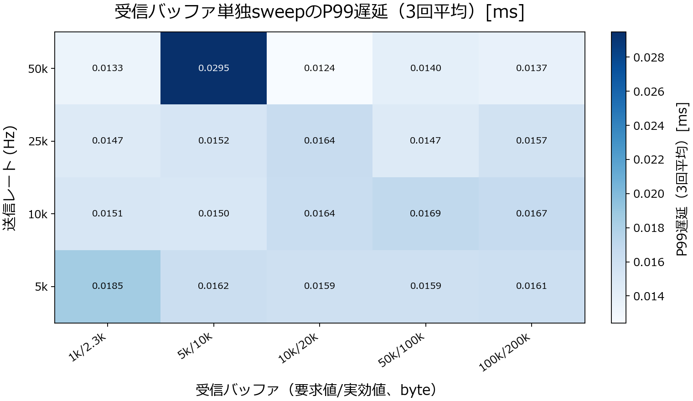

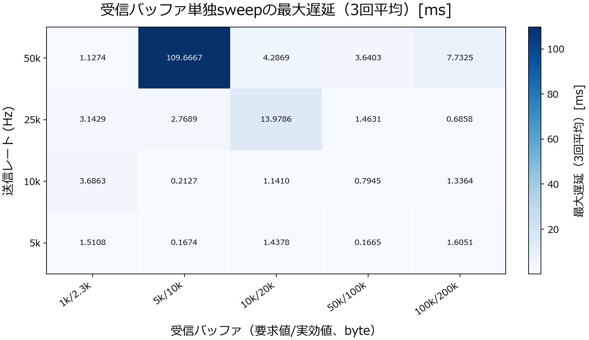

</details>

#### 2-4. CPU affinity比較

- **やったこと**：TX/RXそれぞれのcore固定有無を変え、送信レートごとのpacket欠落とP99遅延を比較。
- **現象**：RX側をcore固定すると、複数の送信レートでP99遅延が低下した。一方、TX側のcore固定では、P99遅延やpacket欠落に一貫した傾向は確認できなかった。高レートではcore固定後もpacket欠落が残った。
- **示唆**：RX側のcore固定は受信処理のschedulingばらつきを抑え、P99遅延の低減に有効な可能性がある。一方、TX側については今回の測定から明確な効果は判断できず、core affinityだけでは高負荷時のpacket欠落は解消できない。


<details>
<summary>その他の計測グラフ（CPU affinity比較）</summary>

**500 kHz（高レート）でのTX/RX pin組み合わせ比較**


**50 kHz（中レート）でのTX/RX pin組み合わせ比較**


**5 kHz（低レート）でのTX/RX pin組み合わせ比較**


**RX pin固定なし・TX pin×送信レート**


**TX pin固定なし・RX pin×送信レート**


**遅延時系列（run単位）**


</details>

### 3. Pi 5 loopbackでの障害検知・欠落回復

**目的**：Pi 5のUDP loopbackで、再送・XOR FEC・Adaptive Rate(FSMによる障害検知)によるpacket欠落回復、故障注入による観測系の妥当性を検証する。

**実験方法**：欠落回復：Retransmit、XOR FEC、Adaptive RateをそれぞれON/OFFで比較し、欠落削減と遅延・受信量への影響を測定。

#### 3-1. Retransmit

- **やったこと**：
  - RXからTXへのfeedback通信を追加し、欠落したsequence範囲を通知。
  - TX側で送信済みpacketを一定量保持し、通知された欠落分を再送。
  - Retransmit ON/OFFを各3 trialで比較し、実効欠落数と遅延への影響を評価。
- **現象**：Retransmit ONでは、欠落していたframeのうち54,801 frameを再送で回復し、最終的に未受信のまま残ったframe数は517,431 → 280,728へ45.7%減少した。一方、再送待ちによって平均遅延は0.750 → 10.003 msへ増加した。
- **示唆**：Retransmitはpacket欠落の回復には有効だが、その代わりに遅延が大きく増える。
- **次の一手**：再送するpacket数やfeedbackの間隔を調整し、欠落を減らしつつ遅延が増えすぎない条件を探す。
- 
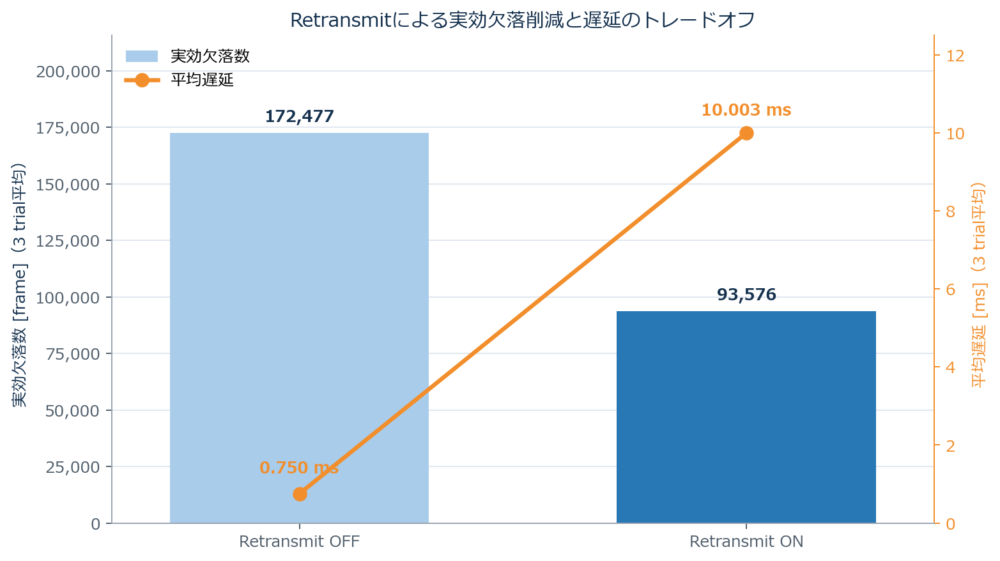

関連データ: [Retransmitレポート](reports/w09_retransmit_summary.md)

#### 3-2. XOR FEC

- **やったこと**：k=4, r=1のXOR parityを追加し、UDP datagramを10%の確率でrandom dropさせた条件でFEC ON/OFFを同一seedで比較。
- **現象**：現象：120 kHzでは、FECにより欠落frameの約73%を回復し、最終欠落率は10.0% → 2.7%に低下。利用可能なdatagramも約90.0% → 97.3%に増加した。
- **次の一手**：今回のUDP datagramを独立に10% random dropさせる条件では単発欠落が中心になるため、burst lossやbit/byte破損など異なる欠落・破損方法でも回復性能を比較する


#### 3-3. Adaptive Rate

##### 3-3-1. 欠落率ベースのAdaptive Rate評価

- **やったこと**：RXからfeedbackでpacket欠落率をTXへ通知し、packet欠落率に応じて送信rateを上下させる単純なAdaptive Rateを実装。ON/OFFを各10 trialで比較。
- **現象**：packet欠落率は2.89% → 2.77%とわずかに改善した一方、rateを下げすぎて受信frame総数は約54%まで減少した。具体例としてrun3では、13秒付近の約0.03%という小さな欠落にも反応し、送信rateが約86 kHz → 69 kHzへ低下した。
- **示唆**：run3のように、packet欠落率だけに反応する今回の制御では小さな一時的lossにも過剰反応し、受信処理限界付近のrateを維持できなかった。
- **次の一手**：複数windowでpacket欠落の継続を判定し、FSMでNormal / Degraded / Recoverを管理することで、一時的なlossではrateを変えず、継続的な悪化時のみrateを下げ、回復時は段階的に戻す制御へ改善する。


**具体例（Adaptive Rate ON run3）**

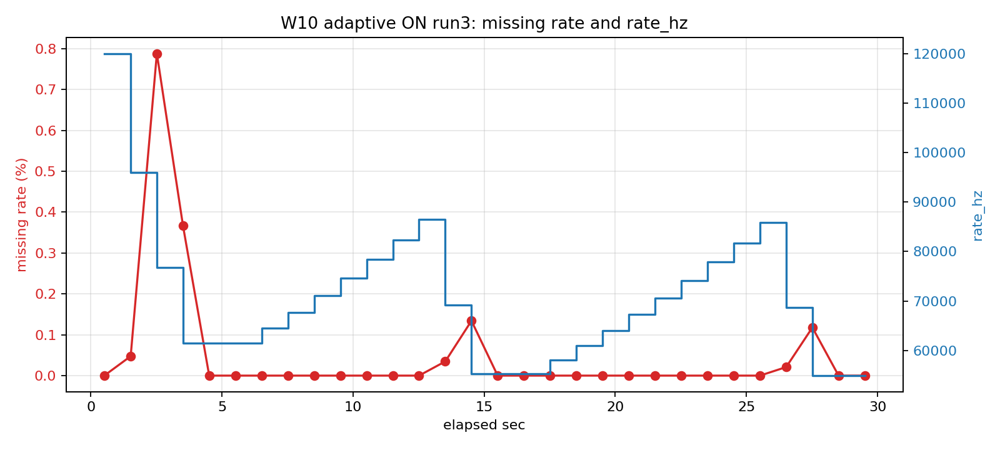

<details>
<summary>その他の計測グラフ（Adaptive Rate）</summary>


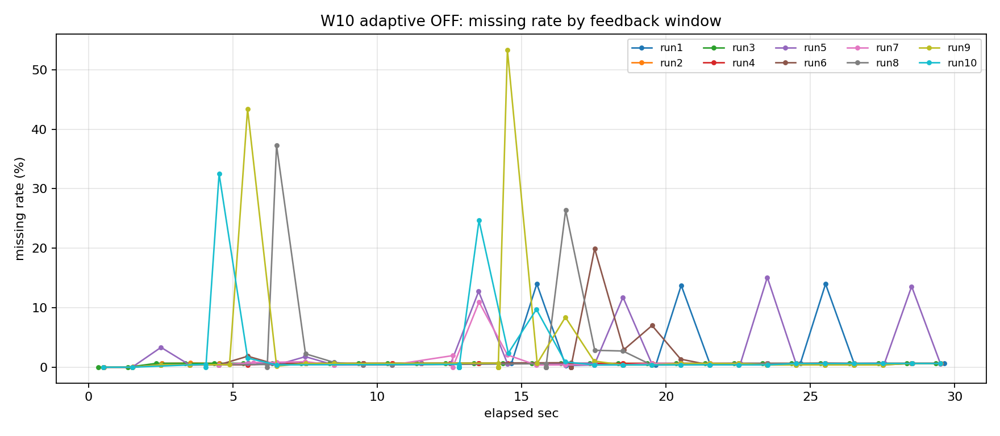

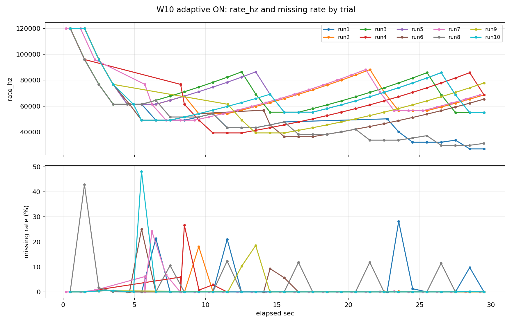

**ON各run（上掲のrun3を除く）の欠落率とrate推移**

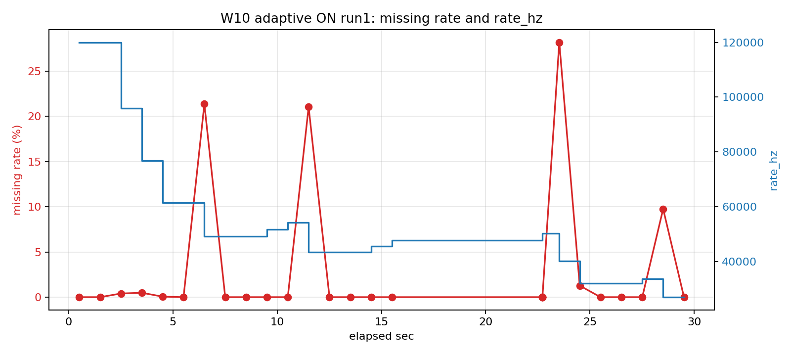

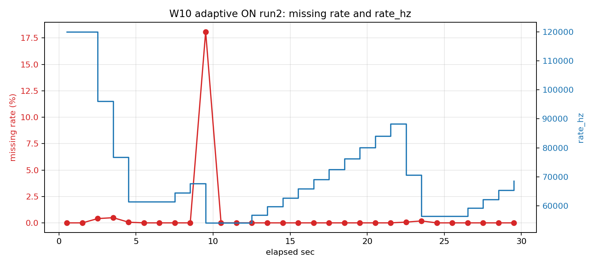

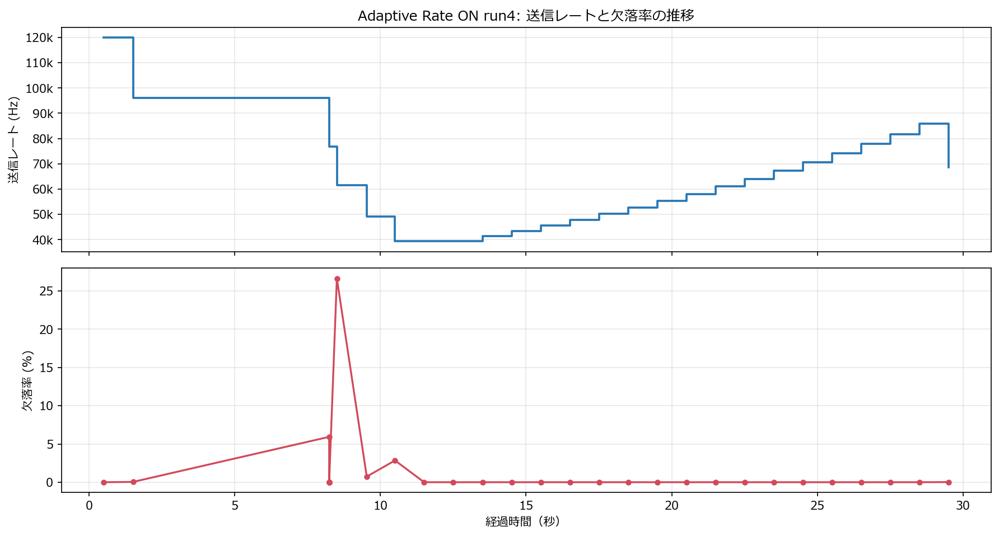


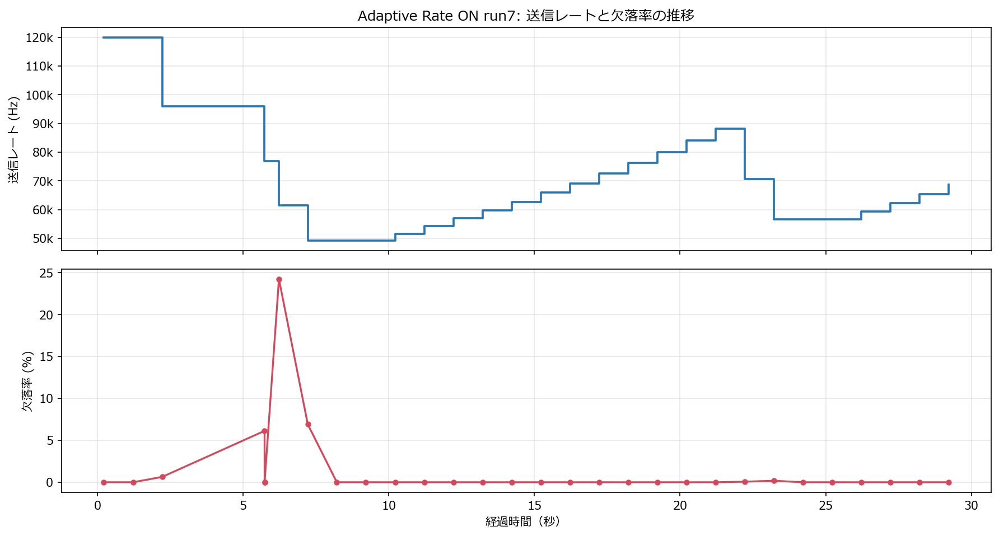

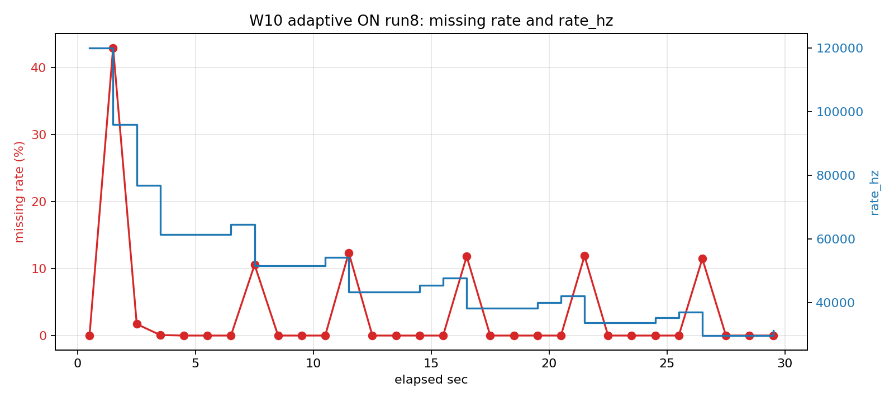

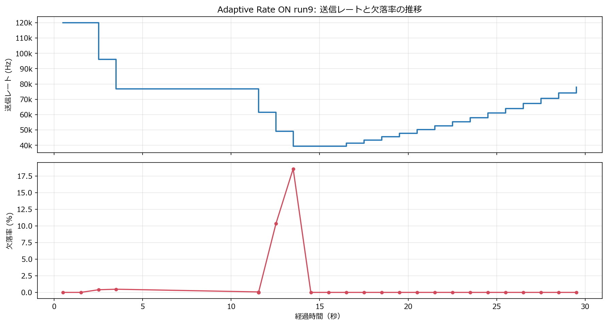

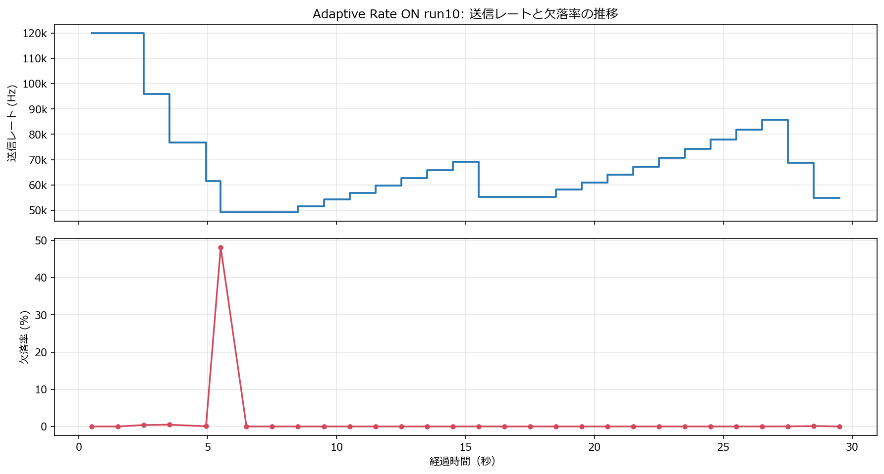

</details>

##### 3-3-2. Adaptive Rate改善の第一歩、障害検知FSMとtimeout-only比較

- **やったこと**：0.5秒、1秒、3秒の通信停止を再現し、FSMとtimeout-onlyを比較。
- **現象**：0.5/1秒停止は誤検知なし。3秒停止では `Normal → Degraded → Recover → Normal` を検出。FSM復旧完了7,667 ms、timeout-only 8,000 ms。
- **示唆**：短時間の揺らぎと長時間障害を区別し、復旧状態を明示できる。
- **次の一手**：このFSMによる障害継続判定をAdaptive Rateへ組み込み、Normalではrateを維持し、Degradedでは段階的に下げ、Recoverでは段階的に戻す制御へ発展させる。


結論

そうです。3-4は「比較」より、**ここまでで何が分かって、次にどう欠落と遅延を同時に減らすか**に寄せる方がいいです。

#### 3-4. 3方式のまとめと次の一手

* **まとめ**
| 方式            | 解決したい問題               | 今回の結果                                |
| ------------- | --------------------- | ------------------------------------ |
| Adaptive Rate | 送信rate過大による受信処理詰まり・欠落 | missing率は小幅改善したが、rateを下げすぎて受信量が大きく低下 |
| Retransmit    | 発生済みのpacket欠落         | 欠落を回復できたが、再送待ちで遅延が大きく増加              |
| XOR FEC       | randomな単発datagram欠落   | 欠落率を大きく改善したが、複数欠落やparity欠落は回復不可      |


* **次の一手**：Adaptive Rate・Retransmit・FECを組み合わせ、欠落を抑えつつ遅延も増やしすぎない制御を作る。さらにFSMで通信状態を管理し、悪化時・回復時に使う方式を切り替える。


比較データ: [W09総合サマリー](reports/w09_missing_improvement_final_summary.md)


### 4. PicoでのBare-metal / FreeRTOSリアルタイム性評価

- **目的**：Pico上で、Bare-metalとFreeRTOS task分離による周期TX処理の時間ずれを比較し、RTOSによって周期処理を安定化できるか検証する。
- **実験方法**：同一のRX workloadをBare-metalとFreeRTOSで各3回実行し、周期TXの時間ずれとtask間通信の遅延を比較する。Bare-metalはRX・STATE・TXを順番に処理し、FreeRTOSは3つのtaskに分離してTX taskを高優先度で実行する。

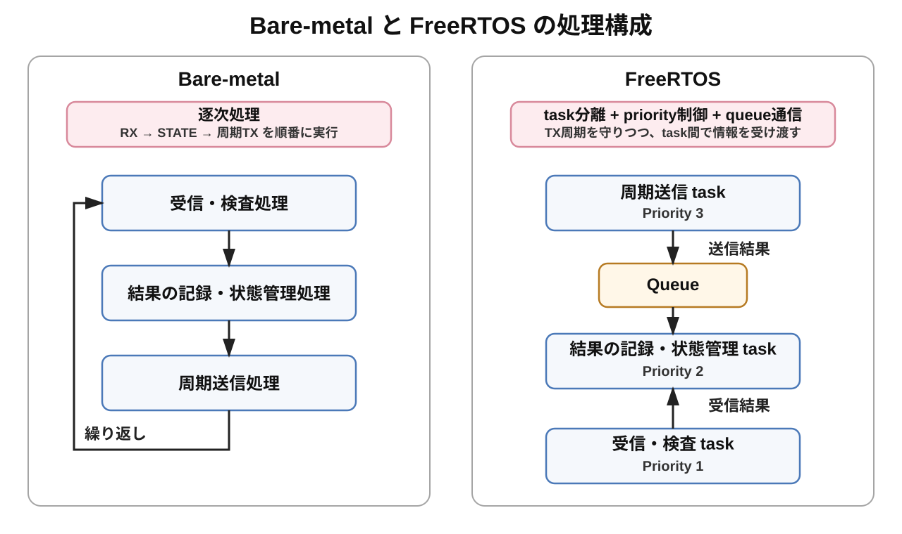

#### 4-1. Bare-metal / FreeRTOSの周期TX比較
- **やったこと**：Bare-metalとFreeRTOSで同じRX workloadを与え、各周期の予定開始時刻と実開始時刻のずれ、およびdeadline missを比較。
- **現象**：Bare-metalではTX jitter P95/P99が1,839 µsだったのに対し、FreeRTOSでは0 µs、deadline missも0件だった。
- **示唆**：task分離と優先度制御により、RX処理の負荷から周期TX処理を分離できた。


#### 4-2. FreeRTOS task間通信の遅延評価
- **やったこと** ：TX taskからSTATE taskへQueueで結果を渡し、queue hand-off latencyとeventの欠落を測定。
- **現象**：
  - **遅延**：queue hand-off latencyはP95/P99ともに8 µs、最大80 µsだった。
  - **欠落**：3,000件のeventをすべてSTATE taskで受信でき、queue送信失敗、受信欠落ともに0件だった。
- **示唆**：今回の条件では、Queueを用いたtask間通信による遅延は小さく、TX処理と結果の記録・状態管理をtask分離しても、低遅延で情報を受け渡せる。


<details>
<summary>その他の計測グラフ（RTOS）</summary>
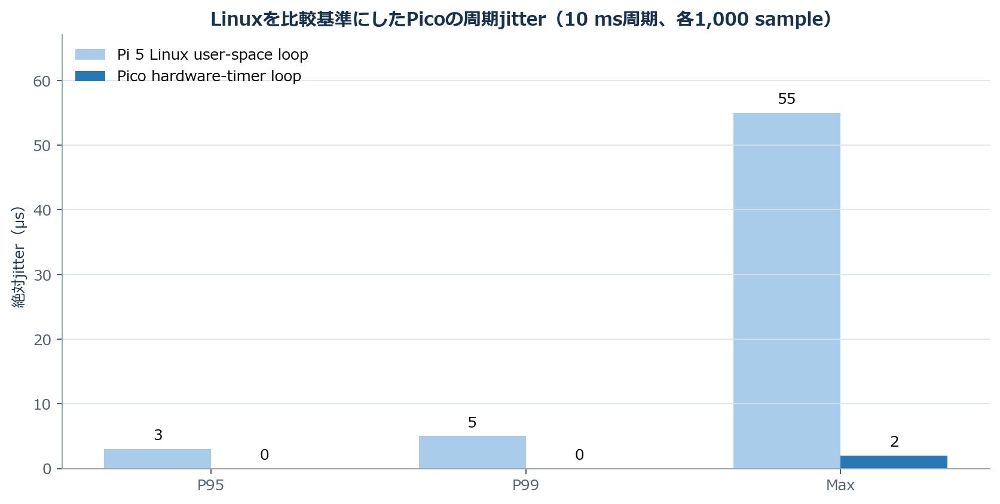
</details>


## 5. 次の一手

ここまで、欠落への対策としてAdaptive Rate・Retransmit・FEC、通信状態の把握としてFSM、周期処理の安定化としてFreeRTOSを個別に検証した。次はこれらを統合し、通信状態に応じて適切な制御を切り替える。

1. **FSM × Adaptive Rate**
   `Normal / Degraded / Recover`に応じて送信rateを変更し、一時的な欠落では過剰にrateを下げない制御にする。

2. **Retransmit × FEC**
   FECで単発欠落を即時回復し、回復できなかったpacketだけを再送することで、欠落と再送遅延を抑える。

3. **FreeRTOS × 通信制御**
   Adaptive Rate、Retransmit、FEC、FSMの処理をtaskとして分離し、通信処理を追加しても周期TXを安定して実行できる構成にする。

4. **Pi 5–Pico実機通信へ統合**
   loopbackで検証した通信制御をPi 5–Pico間へ適用し、実機通信で欠落率・遅延・周期処理を評価する。


## 目次

- [adaptive-udp-link](#adaptive-udp-link)
  - [検証したことと結果](#検証したことと結果)
    - [1. Pi 5–Pico UART実機通信](#1-pi-5pico-uart実機通信)
      - [1-1. 実機bring-upでの故障切り分け](#1-1-実機bring-upでの故障切り分け)
      - [1-2. packet通信の実機成立とMCU内部状態の突き合わせ](#1-2-packet通信の実機成立とmcu内部状態の突き合わせ)
    - [2. Pi 5 loopbackでのUDP性能評価](#2-pi-5-loopbackでのudp性能評価)
      - [2-1. 送信レートを上げたときの限界測定](#2-1-送信レートを上げたときの限界測定)
      - [2-2. socket buffer比較](#2-2-socket-buffer比較)
      - [2-4. CPU affinity比較](#2-4-cpu-affinity比較)
    - [3. Pi 5 loopbackでの障害検知・欠落回復](#3-pi-5-loopbackでの障害検知欠落回復)
      - [3-1. Retransmit](#3-1-retransmit)
      - [3-2. XOR FEC](#3-2-xor-fec)
      - [3-3. Adaptive Rate](#3-3-adaptive-rate)
        - [3-3-1. 欠落率ベースのAdaptive Rate評価](#3-3-1-欠落率ベースのadaptive-rate評価)
        - [3-3-2. Adaptive Rate改善の第一歩、障害検知FSMとtimeout-only比較](#3-3-2-adaptive-rate改善の第一歩障害検知fsmとtimeout-only比較)
      - [3-4. 3方式のまとめと次の一手](#3-4-3方式のまとめと次の一手)
    - [4. PicoでのBare-metal / FreeRTOSリアルタイム性評価](#4-picoでのbare-metal--freertosリアルタイム性評価)
      - [4-1. Bare-metal / FreeRTOSの周期TX比較](#4-1-bare-metal--freertosの周期tx比較)
      - [4-2. FreeRTOS task間通信の遅延評価](#4-2-freertos-task間通信の遅延評価)
  - [5. 次の一手](#5-次の一手)
  - [目次](#目次)
  - [使った技術](#使った技術)
  - [実装したもの](#実装したもの)
  - [実験設計の方針](#実験設計の方針)
  - [現時点の課題と次にやりたいこと](#現時点の課題と次にやりたいこと)
    - [現時点の課題](#現時点の課題)
    - [次にやりたいこと](#次にやりたいこと)
  - [詳細ドキュメント](#詳細ドキュメント)
  - [開発の進め方](#開発の進め方)

## 使った技術

| 領域 | 内容 |
|------|------|
| 言語 | C11（実装本体）、Python 3（解析・MCU harness）、Bash（実験自動化） |
| 通信 | UDP / POSIX socket、`SO_RCVBUF`・`SO_SNDBUF` 制御、UART (115200 8N1) |
| プロトコル | 自作frame形式（preamble、seq、length、CRC-32/ISO-HDLC）、feedback packet、XOR FEC |
| 組込み | Raspberry Pi Pico (RP2040)、Pico SDK、FreeRTOS、CMake、USB CDC |
| 計測 | `clock_gettime(CLOCK_MONOTONIC)`、nearest-rank percentile、CPU affinity (`sched_setaffinity`) |
| 環境 | Raspberry Pi 5 / Linux 6.12.75-rpi / gcc 14.2.0、GitHub Actions、Git LFS |

## 実装したもの

外部ライブラリに頼らず、frame処理から適応制御まで C で実装している。

| ファイル | 行数 | 主な内容 |
|----------|-----:|----------|
| `src/rx.c` | 1,923 | 受信ループ、stream buffer と resync、障害検知FSM、遅延percentile、feedback送出、重複・回復判定 |
| `src/tx.c` | 1,687 | 周期送信スケジューラ、rate適応制御、再送バッファ、FEC parity生成 |
| `src/frame_v1_wire.c` | 340 | frame v1 の encode / decode、CRC-32 |
| `src/fec_v1_wire.c` | 93 | XOR FEC parity のwire形式 |
| `src/feedback_v1_wire.c` | 86 | feedback packet のwire形式 |
| `src/test_framer.c` | 248 | frame処理の単体テスト |
| `firmware/mcu_uart_link/` | 358 | MCU UART parser（Pico SDK非依存でホストテスト可能）+ Pico応用層 |

主要な実装要素:

- **stream parser**：UARTもUDPもバイト境界が保証されないため、preamble探索・部分受信の保持・不正header検出後のresyncを自前で実装
- **障害検知FSM**：`Normal → Degraded → Recover → Normal` の状態遷移をCSVに記録し、timeout単独方式と比較可能にした
- **percentile算出**：nearest-rank規則を固定し、trial間で比較できる形に統一
- **適応制御**：feedbackで観測した欠落率をもとに、rate制御・再送・XOR FECを実装して個別に効果測定

## 実験設計の方針

「速くなった / 直った」を主張する前に、比較可能な条件を先に固定した。

- **1実験1因子**：共通baselineを `before` として使い回し、各実験では候補因子を1つだけ変える（[W08共通baseline条件](docs/w08/baseline_conditions.md)）
- **3 trial以上**：単発の値では判断しない。W04では3 trialの `latency_p99_ms` が平均から全て±15%以内なら `reproducible=yes` と判定する基準を先に決めた
- **percentile規則の固定**：nearest-rankに統一し、trial間・実験間で同じ意味の数値として比較できるようにした
- **同一seed比較**：FEC ON/OFFのような効果測定では同じdrop seedを使い、条件差以外が動かないようにした
- **最小構成から**：XOR FECは `k=4, r=1`（データ4 + parity 1、冗長度25%）を最小構成として実装し、単発欠落の回復能力を先に確認してから限界を調べた

## 現時点の課題と次にやりたいこと

4つの検証領域で、Pi 5–Pico UART通信、ホスト内UDPの限界、障害検知と欠落回復方式、Pico側の周期処理を個別に評価しました。一方で、以下はまだ検証範囲が限定されています。

### 現時点の課題

- **実ネットワークのend-to-end評価が未実施**：Pi 5 loopbackは物理NIC、スイッチ、無線、伝送路の揺らぎを含まないため、実ネットワークで同じ欠落率・末尾遅延になるとは限らない。
- **Pi 5–Pico間の統合評価が未完了**：UART通信は実機で成立し、Pico RTOSの評価系も揃っているが、Pi 5のUDP自己回復処理とPicoの実通信処理を一つのend-to-end経路として接続していない。1章のUART linkは10 packetの正常系baselineまでで、故障注入や長時間運転はこれから。
- **FECの回復範囲**：`k=4, r=1`では同一block内の複数欠落やparity欠落を復元できない。
- **再送の鮮度問題**：retransmitは欠落を回復できる一方、古いframeの後着で遅延が増える。
- **長時間・多環境の再現性**：今回の比較は主に3〜10 trialであり、長時間運転、異なる負荷、複数ボードでの評価はこれからである。

### 次にやりたいこと

1. **Pi 5–Pico end-to-end接続**：UARTまたは実ネットワーク経路で、Pi 5の送信・feedback・自己回復とPicoの受信・telemetryを接続し、通信全体のP99、欠落、復旧時間を測る。
2. **実ネットワークでの再検証**：有線・無線、遅延・loss・burst lossを注入し、loopbackで得た限界値との差分を測定する。
3. **適応制御の統合**：欠落率、queue backlog、遅延をfeedbackに集約し、rate制御・再送・FECを状況に応じて切り替える。
4. **FECと再送の拡張**：複数parity、blockサイズ変更、burst lossへの対応を比較し、回復率と冗長量の最適点を探る。
5. **リアルタイム経路の実測**：PicoのFreeRTOS task jitterだけでなく、実際のUDP/UART送受信、driver、buffer、queueを含むend-to-end遅延を測る。
## 詳細ドキュメント

| 内容 | 場所 |
|------|------|
| 実験レポート・グラフ | [`reports/`](reports/) |
| 生データ・実機baseline | [`data/`](data/) |
| UDP frame仕様 | [`docs/protocol.md`](docs/protocol.md) |
| MCU UART packet仕様 | [`docs/mcu_uart/protocol.md`](docs/mcu_uart/protocol.md) |
| XOR FEC設計 | [`docs/w09/xor_fec_design.md`](docs/w09/xor_fec_design.md) |
| 再送設計 | [`docs/w09/retransmit_design.md`](docs/w09/retransmit_design.md) |
| RTOS task構成 | [`docs/w07_task_architecture.md`](docs/w07_task_architecture.md) |
| 故障シグネチャ判定 | [`docs/fault_target_signatures.md`](docs/fault_target_signatures.md) |
| ビルド・実験手順 | [`docs/runbook.md`](docs/runbook.md) |

## 開発の進め方

個人開発だが、再現性を保つため以下を固定している。

- **CI**：[GitHub Actions](.github/workflows/ci.yml) で `make all` と `make test` を push / PR ごとに実行
- **issue駆動**：設計判断と受け入れ条件を [`docs/issues/`](docs/issues/) に残してから着手
- **PR運用**：[`docs/pr_operation.md`](docs/pr_operation.md) に手順を固定
- **コーディング規約**：整数printf formatの方針を [`docs/c_integer_printf_format_policy.md`](docs/c_integer_printf_format_policy.md) に明文化（`PRI*` macroを使わず明示cast + 明示format）
- **大容量データ**：計測CSVは Git LFS で管理し、リポジトリ本体を軽く保つ
- **ボード選定**：比較検討の経緯を [`docs/board_selection.md`](docs/board_selection.md) に記録
