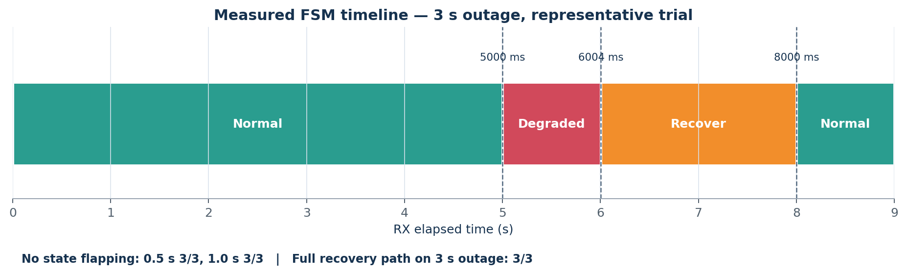
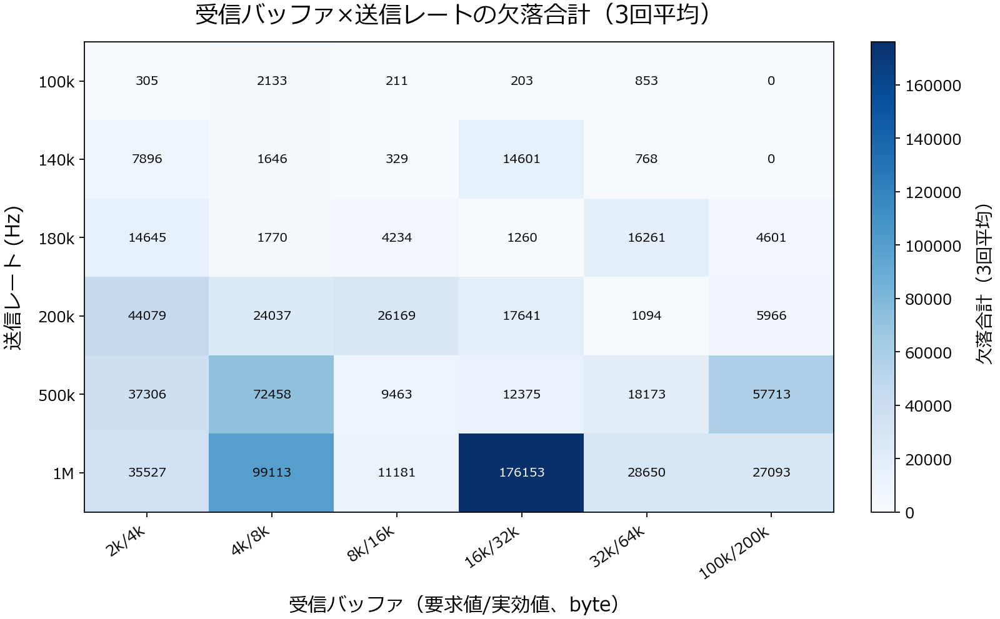
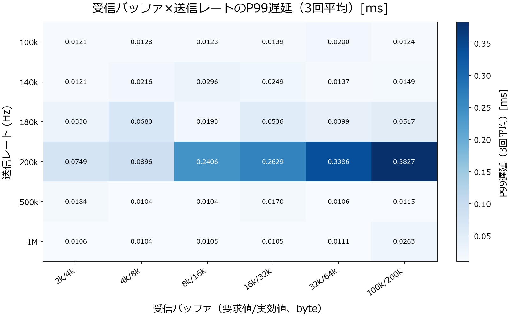
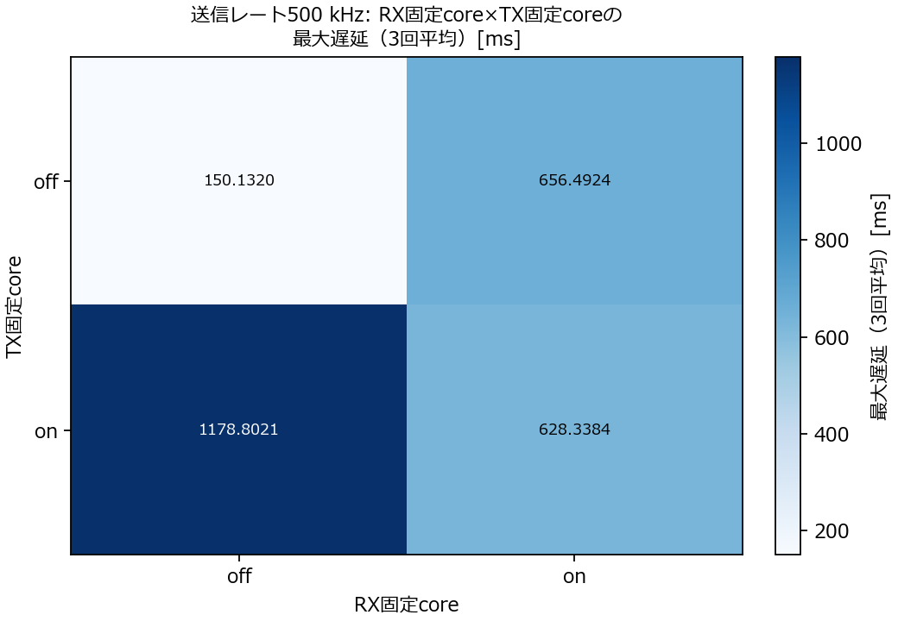
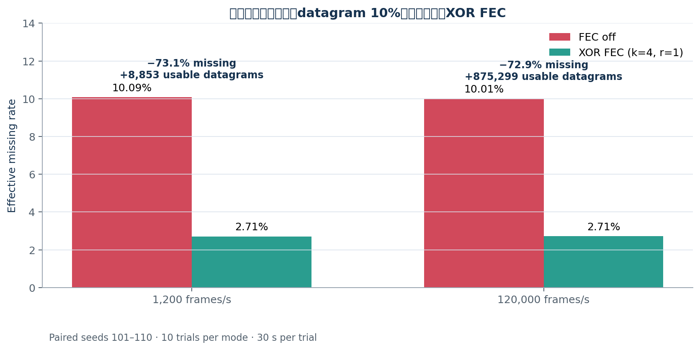
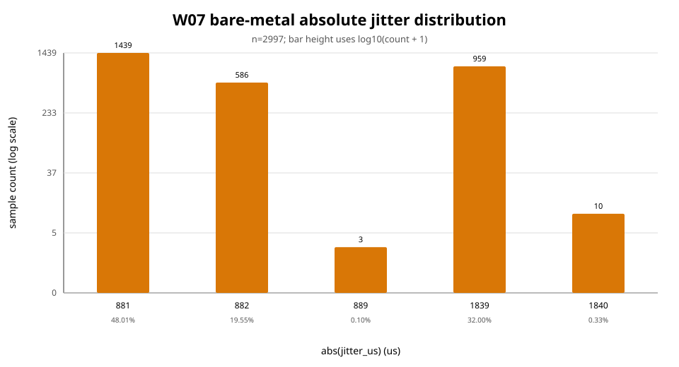
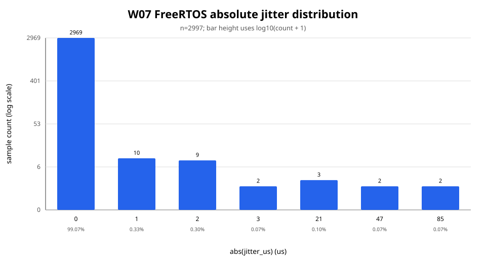
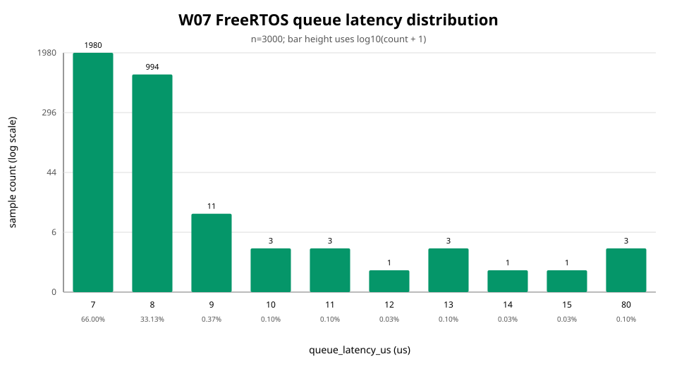
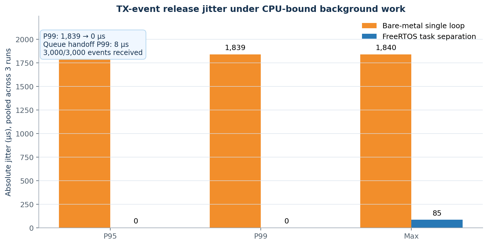

# adaptive-udp-link

UDP ベースの自己回復リンク基盤を段階的に実装しながら、観測・耐障害化・適応制御まで積み上げる C プロジェクトです。W04 では「同一条件での計測結果を再現できること」を重視し、`trial_summary`、1 秒統計、再現性チェック、CI を固定しています。
## 目次

- [3つの主要成果](#3つの主要成果)
  - [Pi 5–Pico UART通信・telemetry評価](#1-pi-5pico-uart通信telemetry評価)
    - [UART packet通信](#1-1-uart-packet通信)
    - [MCU telemetryとsummary](#1-2-mcu-telemetryとsummary)
  - [Pi 5 loopbackでのUDP性能評価・障害検知・自己回復](#2-pi-5-loopbackでのudp性能評価障害検知自己回復)
    - [再現性評価](#2-1-再現性評価)
    - [障害検知FSMとtimeout-only比較](#2-2-障害検知fsmとtimeout-only比較)
    - [送信レート sweep](#2-3-送信レート-sweep)
    - [socket buffer比較](#2-4-socket-buffer比較)
    - [CPU affinity比較](#2-5-cpu-affinity比較)
    - [UDP自己回復機構](#2-6-udp自己回復機構)
      - [Adaptive Rate](#2-6-1-adaptive-rate)
      - [Retransmit](#2-6-2-retransmit)
      - [XOR FEC](#2-6-3-xor-fec)
      - [3方式の比較](#2-6-4-3方式の比較)
  - [PicoでのBare-metal / FreeRTOSリアルタイム性評価](#3-picoでのbare-metal--freertosリアルタイム性評価)
    - [Bare-metal周期処理](#3-1-bare-metal周期処理)
    - [FreeRTOS task分離](#3-2-freertos-task分離)
    - [FreeRTOS queue hand-off](#3-3-freertos-queue-hand-off)
    - [LinuxとPicoの周期jitter比較](#3-4-linuxとpicoの周期jitter比較)
- [成果物と再現方法](#成果物と再現方法)
- [開発・実験コマンド](#開発実験コマンド)
  - [Build And Test](#build-and-test)
  - [Quick Loopback Run](#quick-loopback-run)
  - [Reproducibility Check](#reproducibility-check)
  - [W05 Recovery Matrix](#w05-recovery-matrix)
  - [W05 FSM Vs Timeout Compare](#w05-fsm-vs-timeout-compare)
  - [How To Read P95 And P99](#how-to-read-p95-and-p99)
  - [Protocol Notes](#protocol-notes)
  - [CI](#ci)
- [Repository Layout](#repository-layout)
- [Prerequisites](#prerequisites)
## 3つの主要成果

### 1. Pi 5–Pico UART通信・telemetry評価

**目的**：Pi 5とPico間のpacket通信を実機構成で確認し、ACK/NACK、CRC、sequence、telemetryを観測可能にする。

**実験方法**：Pi 5側のPC harnessからUARTでDATA packetを送信し、PicoからACK/NACKとtelemetryを受信。送受信ログをCSVに保存し、summaryを生成する。

**結果のまとめ**：UART packet format、PC harness、Pico firmware、telemetry schema、summary生成の一連の評価系を整備した。sample baselineではCRC error 0、sequence gap 0を確認できる構成になっている。

#### 1-1. UART packet通信

- **やったこと**：DATA packetをPi 5からPicoへ送信し、Pico側のACK/NACKを記録。
- **現象**：PC TX/RXログとMCU telemetryをtrial単位で保存できる。
- **示唆**：UDP loopbackとは別に、実機MCUを含む通信経路を同じCSVベースで評価できる。

#### 1-2. MCU telemetryとsummary

- **やったこと**：CRC error、sequence gap、送受信数、MCU stateをtelemetryとして収集し、summary.csvに集計。
- **現象**：sample baselineではCRC error 0、sequence gap 0、正常状態を確認。
- **示唆**：通信結果だけでなく、MCU内部状態と通信品質を対応付けて分析できる。

関連資料: [UART demo](docs/mcu_uart_link_demo.md)、[PC harness](scripts/mcu_uart/pc_harness.py)、[sample baseline](data/mcu_uart/sample_baseline/)。

### 2. Pi 5 loopbackでのUDP性能評価・障害検知・自己回復

**目的**：再現可能な計測基盤を作り、障害検知とUDP処理の限界を定量化する。

**実験方法**：Pi 5 loopbackで複数trialを実行し、再現性、outage、送信レート、socket buffer、CPU affinityを比較する。

**結果のまとめ**：120,000 Hzまでは欠落なし。3秒outageではFSMが復旧状態まで検出。bufferやaffinityはdrop・tail latency・再現性に影響した。

#### 2-1. 再現性評価

- **やったこと**：同一条件で3 trialを実行し、P50/P95/P99、pps、CPU使用率を比較。
- **現象**：120 frame/s条件でP99平均0.360 ms、最大偏差6.94%、再現性判定 `yes`。
- **示唆**：単発値ではなく、複数trialの分布で性能を評価できる。

関連データ: [W04再現性CSV](logs/reproducibility/w04_baseline_20260429/reproducibility_check.csv)

#### 2-2. 障害検知FSMとtimeout-only比較

- **やったこと**：0.5秒、1秒、3秒の通信停止を再現し、FSMとtimeout-onlyを比較。
- **現象**：0.5/1秒停止は誤検知なし。3秒停止では `Normal → Degraded → Recover → Normal` を検出。FSM復旧完了7,667 ms、timeout-only 8,000 ms。
- **示唆**：短時間の揺らぎと長時間障害を区別し、復旧状態を明示できる。



#### 2-3. 送信レート sweep

- **やったこと**：50〜1,000,000 Hzで送信し、missing、CPU、P95/P99/max latencyを測定。
- **現象**：120,000 Hzまでは欠落なし。140,000 Hzからgap。500,000 Hzではmissing率2.37%、P99 latency 0.410 ms。
- **示唆**：限界はlatency悪化より先にdropとして現れるため、missingとtail latencyを同時に見る必要がある。



#### 2-4. socket buffer比較

- **やったこと**：socket bufferサイズを変え、dropとlatencyを比較。
- **現象**：buffer増加でdropは減る一方、queue滞留によりP95/P99/max latencyが増える条件を確認。
- **示唆**：drop最小化とtail latency最小化はトレードオフ。



#### 2-5. CPU affinity比較

- **やったこと**：TX/RXを同一core、別coreに固定して比較。
- **現象**：低〜中レートでは末尾latency outlierの切り分けに有効。高レートではcore分離後も飽和dropが残った。
- **示唆**：affinityは高速化の万能策ではなく、再現性向上と原因分離の手段。




#### 2-6. UDP自己回復機構

**目的**：欠落原因ごとに回復方式を選び、missing削減とlatency・throughputのトレードオフを評価する。

**実験方法**：feedback packetを追加し、Adaptive Rate、Retransmit、XOR FECを実装。ON/OFF、同一drop seed、複数trialで比較する。

**結果のまとめ**：Adaptive Rateは小幅改善、Retransmitは欠落回復と引き換えにlatency増加、XOR FECはrandom dropに対して約73%のeffective missing削減を確認した。

##### 2-6-1. Adaptive Rate

- **やったこと**：feedbackでmissingを検出し、送信rateを動的に下げる制御を実装。
- **現象**：missingは2.8919%から2.7661%へ改善。一方、受信総量は約54%に低下。
- **示唆**：最大throughputではなく、輻輳時の退避機構として適する。


##### 2-6-2. Retransmit

- **やったこと**：feedbackで欠落範囲を通知し、bounded bufferから再送。
- **現象**：effective missingを45.7%削減し、54,801 frameを回復。平均latencyは0.750 msから10.003 msへ増加。
- **示唆**：完全性を高められるが、古いframeの後着によるlatency増加を許容する必要がある。

関連データ: [Retransmitレポート](reports/w09_retransmit_summary.md)

##### 2-6-3. XOR FEC

- **やったこと**：k=4、r=1のXOR parityを追加し、random drop 10%条件でFEC ON/OFFを同一seedで比較。
- **現象**：effective missingを約73%削減。120 kHzではusable datagramが875,299件増加。
- **示唆**：単発datagram欠落には強いが、同一block内の複数欠落やparity欠落は回復できない。



##### 2-6-4. 3方式の比較

- **やったこと**：raw missing、recovered、effective missing、usable datagram、latencyを方式間で比較。
- **現象**：3方式すべてで欠落改善を確認したが、Adaptive Rateは受信量低下、Retransmitはlatency増加、FECはparity待ちと未回復欠落が残った。
- **示唆**：輻輳にはAdaptive Rate、履歴欠落にはRetransmit、ランダム単発欠落にはFECという役割分担が妥当。

比較データ: [W09総合サマリー](reports/w09_missing_improvement_final_summary.md)

### 3. PicoでのBare-metal / FreeRTOSリアルタイム性評価

**目的**：周期TX処理をRX workloadから保護する設計と、task間通信のコストを検証する。

**実験方法**：Picoで同一RX workloadをBare-metalとFreeRTOSで各3回実行し、TX jitter、queue hand-off、deadline missを測定。Pi 5 Linux user-space loopとも比較する。

**結果のまとめ**：FreeRTOSではTX jitter P95/P99が0 µs、queue hand-off P95が8 µs、deadline missが0件。周期処理の分離効果を確認した。

#### 3-1. Bare-metal周期処理

- **やったこと**：単一loop内でRX相当処理と周期TXイベントを実行。
- **現象**：TX jitterのP95/P99は1,839 µs。
- **示唆**：RX workloadの実行時間が周期TXのタイミングに影響した。



#### 3-2. FreeRTOS task分離

- **やったこと**：TX、STATE、RXをtaskに分離し、優先度をTX=3、STATE=2、RX=1に設定。
- **現象**：TX jitterのP95/P99は0 µs、deadline missは0件。
- **示唆**：高優先度TX taskにより周期処理をRX負荷から保護できた。



#### 3-3. FreeRTOS queue hand-off

- **やったこと**：TX taskからSTATE taskへqueueでイベントを渡し、送受信遅延を測定。
- **現象**：queue hand-off P95/P99は8 µs、最大80 µs。3,000イベントを全件受信し、send failureとmissing receiveは0件。
- **示唆**：task分割によるqueue通信は、今回の条件では許容可能なオーバーヘッドだった。



#### 3-4. LinuxとPicoの周期jitter比較

- **やったこと**：Pi 5 Linux user-space loopとPico hardware-timer loopを比較。
- **現象**：LinuxのP99 jitterは5 µs、Picoは0 µs。最大値はLinux 55 µs、Pico 2 µs。
- **示唆**：hardware timerは送信側のスケジューリングノイズを抑える基準として有効。



## 成果物と再現方法

- 実験レポート: [`reports/`](reports/)、生データ: [`data/`](data/)
- プロトコル仕様: [`docs/protocol.md`](docs/protocol.md)、FEC: [`docs/w09/xor_fec_design.md`](docs/w09/xor_fec_design.md)
- ビルド・テスト: `make all && make test`
- レート掃引: `scripts/w08/run_send_interval_sweep.sh`
- FEC 比較: `scripts/w09/run_fec_comparison.sh`

以下は開発者向けの詳細な実行手順です。


## Repository Layout

```text
adaptive-udp-link/
├── README.md
├── Makefile
├── .github/workflows/ci.yml
├── bin/
├── include/
├── src/
├── scripts/
├── logs/
└── docs/
```

## Prerequisites

- `gcc`
- `make`
- `bash`

## 開発・実験コマンド

### Build And Test

```bash
make all
make test
```

`make test` は以下を実行します。

- `bin/test_framer`
- `bash scripts/test_loopback_metrics.sh`

### Quick Loopback Run

10 秒だけローカル loopback で試す場合:

```bash
make run10
```

生成物:

- `logs/run_YYYYMMDD_HHMMSS_10s/rx.log`
- `logs/run_YYYYMMDD_HHMMSS_10s/rx_in_1sec.csv`
- `logs/run_YYYYMMDD_HHMMSS_10s/rx_by_1recv.csv`
- `logs/run_YYYYMMDD_HHMMSS_10s/tx.log`

`rx_in_1sec.csv` では 1 秒ごとに `pps` と `cpu_pct` を確認できます。`pps` は UDP datagram/s、`cpu_pct` はその 1 秒窓での process CPU usage です。

### Reproducibility Check

W04 の標準手順はこのスクリプトです。

```bash
make all
RESULT_DIR=logs/reproducibility/w04_baseline_20260429 bash scripts/run_reproducibility_check.sh
```

主な生成物:

- `logs/reproducibility/w04_baseline_20260429/reproducibility_check.csv`
- `logs/reproducibility/w04_baseline_20260429/interpretation.md`
- `logs/reproducibility/w04_baseline_20260429/trial_1/`
- `logs/reproducibility/w04_baseline_20260429/trial_2/`
- `logs/reproducibility/w04_baseline_20260429/trial_3/`

環境変数で条件を上書きできます。

```bash
RATE_HZ=120 DURATION_SEC=5 PAYLOAD_LEN=64 LINK_NAME=host_loopback \
RESULT_DIR=logs/reproducibility/custom_run bash scripts/run_reproducibility_check.sh
```

### W05 Recovery Matrix

W05 の標準手順はこのスクリプトです。

```bash
make all
RESULT_DIR=logs/fsm_recovery/w05_matrix_baseline bash scripts/run_fsm_recovery_check.sh
```

主な生成物:

- `logs/fsm_recovery/w05_matrix_baseline/fsm_recovery_check.csv`
- `logs/fsm_recovery/w05_matrix_baseline/summary.txt`
- `logs/fsm_recovery/w05_matrix_baseline/scenario_500ms/trial_1/rx.log`
- `logs/fsm_recovery/w05_matrix_baseline/scenario_500ms/trial_1/tx.log`
- `logs/fsm_recovery/w05_matrix_baseline/scenario_500ms/trial_1/state.csv`
- `logs/fsm_recovery/w05_matrix_baseline/scenario_1000ms/trial_1/state.csv`
- `logs/fsm_recovery/w05_matrix_baseline/scenario_3000ms/trial_1/state.csv`

環境変数で条件を上書きできます。

```bash
TRIALS=3 LINK_NAME=host_loopback RESULT_DIR=logs/fsm_recovery/custom_run \
bash scripts/run_fsm_recovery_check.sh
```

`fsm_recovery_check.csv` には少なくとも次の列が入ります。

- `scenario`
- `trial`
- `outage_ms`
- `degraded_detect_ms`
- `recover_complete_ms`

各 run は `scenario_<duration>/trial_<n>/` にまとまり、`rx.log`、`tx.log`、`state.csv` を残します。現行の 2-window FSM では `0.5s` と `1s` の outage は `Degraded` 閾値を跨がないため、`degraded_detect_ms` と `recover_complete_ms` は `na` になります。`3s` シナリオでは `Normal -> Degraded -> Recover -> Normal` の 3 遷移を必須とし、期待した遷移パターンから外れた run はスクリプトが非 0 で終了します。

### W05 FSM Vs Timeout Compare

最終比較はこのスクリプトで行います。

```bash
make all
RESULT_DIR=logs/fsm_recovery/w05_compare_baseline bash scripts/run_fsm_vs_timeout_compare.sh
```

主な生成物:

- `logs/fsm_recovery/w05_compare_baseline/compare_runs.csv`
- `logs/fsm_recovery/w05_compare_baseline/compare_summary.csv`
- `logs/fsm_recovery/w05_compare_baseline/interpretation.md`
- `logs/fsm_recovery/w05_compare_baseline/mode_fsm/scenario_3000ms/trial_1/state.csv`
- `logs/fsm_recovery/w05_compare_baseline/mode_timeout_only/scenario_3000ms/trial_1/state.csv`

`compare_summary.csv` には少なくとも次の列が入ります。

- `outage_ms`
- `mode`
- `degraded_detect_ms`
- `recover_complete_ms`

比較 run も `mode_<name>/scenario_<duration>/trial_<n>/` にまとまり、`rx.log`、`tx.log`、`state.csv` を残します。`interpretation.md` には比較表と、短い outage が `na` になる理由、`fsm` と `timeout-only` の挙動差をまとめます。

### How To Read P95 And P99

各 trial の `rx.log` 末尾に `trial_summary` が出ます。

```text
trial_summary link_name=host_loopback trial=1 duration_sec=7 sent=na recv_ok=... gap_est=... crc_fail=... len_invalid=... preamble_miss=... resync_count=... latency_p50_ms=... latency_p95_ms=... latency_p99_ms=... latency_max_ms=...
```

3 回分をまとめて見るには:

```bash
column -s, -t < logs/reproducibility/w04_baseline_20260429/reproducibility_check.csv
```

重要列:

- `latency_p95_ms`
- `latency_p99_ms`
- `latency_max_ms`
- `p99_deviation_pct_from_mean`
- `reproducible`

### Reproducibility Criterion

W04 では、3 trial の `latency_p99_ms` それぞれについて `abs(trial_p99 - mean_p99) / mean_p99 * 100` を計算し、すべてが `+/-15%` 以内なら `reproducible=yes` と判定します。`interpretation.md` に結果と簡単な解釈を残します。

変動がしきい値を超えた場合は、まず `avg_pps` と `avg_cpu_pct` のばらつきを確認してください。そこが大きい場合、フレーム処理より先にローカルのスケジューリングやバックグラウンド負荷を疑うべきです。

### Protocol Notes

固定列の意味は [docs/protocol.md](docs/protocol.md) を参照してください。W04 では以下を固定しています。

- `trial_summary` の `latency_p50_ms / latency_p95_ms / latency_p99_ms / latency_max_ms`
- 1 秒統計の `pps / cpu_pct`
- percentile の算出規則は nearest-rank

### CI

GitHub Actions は [.github/workflows/ci.yml](.github/workflows/ci.yml) で `make all` と `make test` を `push` / `pull_request` ごとに実行します。
