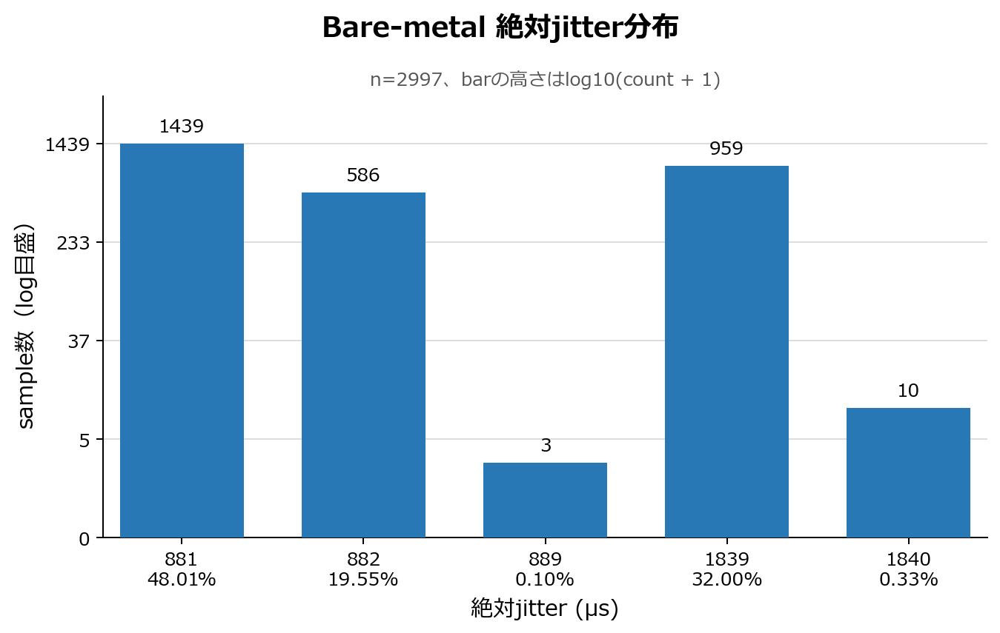
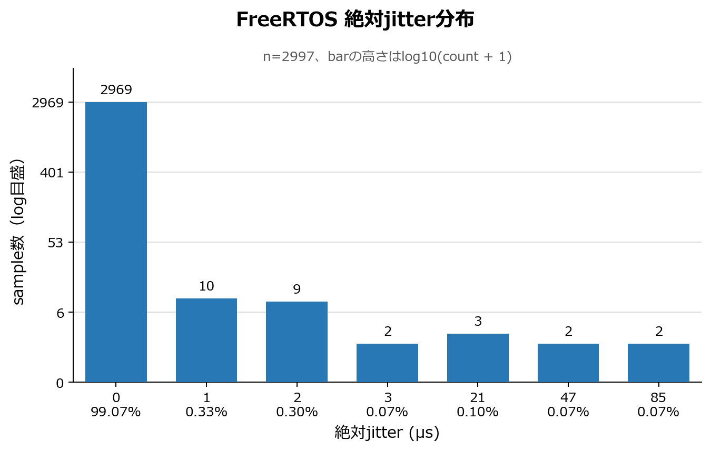
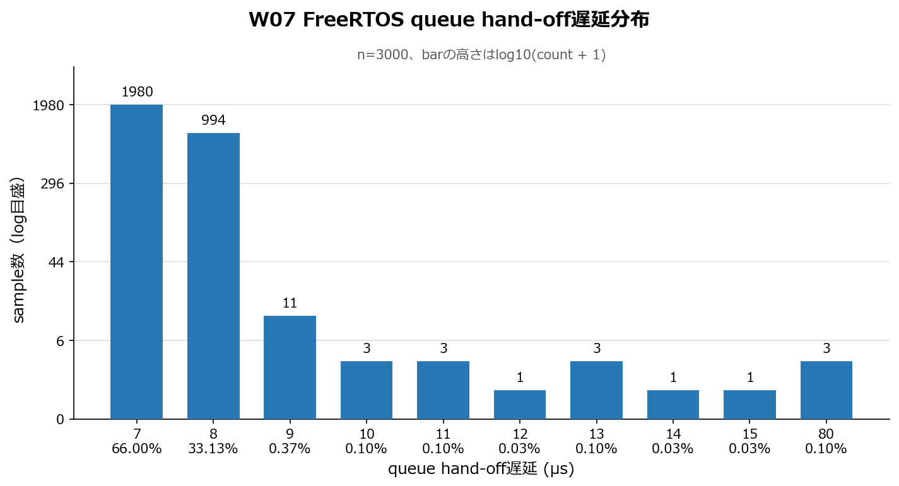

# W07 RTOS Jitter Summary

## Analysis Method

- Input directory: `data/w07`
- Dataset: Raspberry Pi Pico measured CSV, bare-metal / FreeRTOS each 3 runs
- Jitter metric: `abs(jitter_us)`
- Jitter samples: exclude sample 1 because its `delta_us=0` and `jitter_us=0` are synthetic
- Samples per jitter run: 999 intervals
- Mode summary: pooled 2997 intervals from 3 runs
- Percentiles: nearest-rank
- Stddev: population standard deviation
- Queue latency: all valid FreeRTOS events, including sample 1
- Deadline miss: the run-level final counter is counted once per run

## Distribution Figures

Bars represent every distinct observed value. The count axis is logarithmic so rare outliers remain visible; the exact count and percentage are printed for each bar.

## Run-level abs(jitter_us)

| mode | run | intervals | P50 (us) | P95 (us) | P99 (us) | max (us) | stddev (us) | deadline miss |
| --- | --- | ---: | ---: | ---: | ---: | ---: | ---: | ---: |
| baremetal | run1 | 999 | 882.00 | 1839.00 | 1839.00 | 1840.00 | 447.96 | - |
| baremetal | run2 | 999 | 882.00 | 1839.00 | 1839.00 | 1840.00 | 447.96 | - |
| baremetal | run3 | 999 | 882.00 | 1839.00 | 1839.00 | 1840.00 | 447.96 | - |
| freertos | run1 | 999 | 0.00 | 0.00 | 0.00 | 21.00 | 0.68 | 0 |
| freertos | run2 | 999 | 0.00 | 0.00 | 0.00 | 85.00 | 4.39 | 0 |
| freertos | run3 | 999 | 0.00 | 0.00 | 1.00 | 21.00 | 0.69 | 0 |

## Mode-level abs(jitter_us)

| mode | intervals | P50 (us) | P95 (us) | P99 (us) | max (us) | stddev (us) |
| --- | ---: | ---: | ---: | ---: | ---: | ---: |
| baremetal | 2997 | 882.00 | 1839.00 | 1839.00 | 1840.00 | 447.96 |
| freertos | 2997 | 0.00 | 0.00 | 0.00 | 85.00 | 2.60 |

## Bare-metal vs FreeRTOS

| metric | bare-metal (us) | FreeRTOS (us) | reduction (us) | reduction (%) |
| --- | ---: | ---: | ---: | ---: |
| P95 abs jitter | 1839.00 | 0.00 | 1839.00 | 100.00 |
| P99 abs jitter | 1839.00 | 0.00 | 1839.00 | 100.00 |

A positive reduction means that FreeRTOS has lower absolute jitter than bare-metal.

## Final Interpretation

Under these measurement conditions, FreeRTOS task separation reduced pooled P95 and P99 absolute TX-event release jitter by 1839 us (100%) compared with the bare-metal single loop. The result is consistent with the highest-priority `tx_task` being scheduled independently of the simulated RX workload, while the bare-metal loop can check the next TX target only after its current RX-like workload iteration completes.

This is not evidence that FreeRTOS is intrinsically faster. It demonstrates that explicit priority and task separation protected this periodic event from this CPU-bound background workload. The result depends on the workload and scheduling design.

The timestamp is captured when the periodic TX event starts; this firmware does not send a UDP packet. Therefore, these results establish TX-event release jitter, not UDP API latency, driver completion time, or end-to-end packet latency.
A real UDP path may add queueing, task scheduling, buffer allocation, network-stack locking, and driver latency, so its ordering must be measured separately.

## FreeRTOS queue_latency_us

| scope | samples | P50 (us) | P95 (us) | P99 (us) | max (us) | stddev (us) | send fail | not received | deadline miss |
| --- | ---: | ---: | ---: | ---: | ---: | ---: | ---: | ---: | ---: |
| run1 | 1000 | 8.00 | 8.00 | 8.00 | 80.00 | 2.29 | 0 | 0 | 0 |
| run2 | 1000 | 7.00 | 7.00 | 7.00 | 80.00 | 2.34 | 0 | 0 | 0 |
| run3 | 1000 | 7.00 | 7.00 | 7.00 | 80.00 | 2.33 | 0 | 0 | 0 |
| pooled | 3000 | 7.00 | 8.00 | 8.00 | 80.00 | 2.37 | 0 | 0 | 0 |

The queue-send to `state_task` receive delta is the practical task-handoff overhead proxy in this experiment: pooled P95/P99 were 8 us and the maximum was 80 us. It includes queue operations and scheduler response, so it is not an isolated CPU context-switch measurement. A trace-based context-switch measurement was not performed.

All 3000 FreeRTOS events were received, with 0 queue-send failures, 0 missing receives, and 0 deadline misses. Correct priority ordering was required: `TX=3`, `STATE=2`, `RX=1`. Before that correction, the continuously ready RX task starved the lower-priority queue consumer; that diagnostic run is excluded from the official dataset.

## Experiment Conditions

- Target: Raspberry Pi Pico; Raspberry Pi 5 was the build, flashing, capture, and analysis host.
- Period: 10000 us; 1000 samples per run; 3 independent runs per mode.
- Workload: `RX_WORKLOAD_ITERS=20000` in both firmware variants.
- Bare-metal schedule: absolute `target_time_us += 10000` in a single loop.
- FreeRTOS schedule: `xTaskDelayUntil()` with task priorities `TX=3`, `STATE=2`, `RX=1`.
- Capture rule: store timestamps in RAM and print CSV only after all samples are captured.
- Transport for results: Pico USB CDC serial; no GPIO UART wiring.
- Bare-metal firmware SHA256: `78402461cfafa6d5ece5a19c43fc485e880be14f3dc1b483bc64c92eb8ffcd85`.
- FreeRTOS firmware SHA256: `af028e2be0ed34e629564bcbb73c45b3d499edc0dc8438fb2bec647f40b803ee`.

## Constraints And Unverified Items

- UDP API, network driver, on-wire transmission, receiver arrival, and end-to-end latency were not measured.
- `queue_latency_us` is a task-handoff proxy, not a direct context-switch trace.
- A hardware timer/interrupt-driven bare-metal implementation was not compared.
- Results may change with workload shape, compiler optimization, FreeRTOS tick rate, priority assignment, network stack, or board.
- The dataset covers one Pico and three runs per mode; broader hardware and long-duration repeatability were not evaluated.

## Milestone 8 Evidence Package

| evidence | artifact | related PR |
| --- | --- | --- |
| implementation plan | [`docs/w07_plan.md`](../docs/w07_plan.md) | [#110](https://github.com/yosukev2/adaptive-udp-link/pull/110) |
| firmware and build/run record | [`firmware/w07_rtos_jitter/`](../firmware/w07_rtos_jitter/) and [`docs/w07_run_log.md`](../docs/w07_run_log.md) | [#108](https://github.com/yosukev2/adaptive-udp-link/pull/108), [#117](https://github.com/yosukev2/adaptive-udp-link/pull/117) |
| task architecture and priority design | [`docs/w07_task_architecture.md`](../docs/w07_task_architecture.md) | [#111](https://github.com/yosukev2/adaptive-udp-link/pull/111), [#118](https://github.com/yosukev2/adaptive-udp-link/pull/118), [#120](https://github.com/yosukev2/adaptive-udp-link/pull/120) |
| bare-metal Pico captures | [`data/w07/baremetal_run1.csv`](../data/w07/baremetal_run1.csv), [`run2`](../data/w07/baremetal_run2.csv), [`run3`](../data/w07/baremetal_run3.csv) | [#119](https://github.com/yosukev2/adaptive-udp-link/pull/119) |
| FreeRTOS Pico captures | [`data/w07/freertos_run1.csv`](../data/w07/freertos_run1.csv), [`run2`](../data/w07/freertos_run2.csv), [`run3`](../data/w07/freertos_run3.csv) | [#121](https://github.com/yosukev2/adaptive-udp-link/pull/121) |
| validation and statistics | [`scripts/analyze_w07_jitter.py`](../scripts/analyze_w07_jitter.py) and [`data/w07/w07_jitter_summary.csv`](../data/w07/w07_jitter_summary.csv) | [#122](https://github.com/yosukev2/adaptive-udp-link/pull/122) |
| final report and distributions | this report and [`reports/figures/`](figures/) | Issue [#107](https://github.com/yosukev2/adaptive-udp-link/issues/107) |

## Input Runs

- `data/w07/baremetal_run1.csv`
- `data/w07/baremetal_run2.csv`
- `data/w07/baremetal_run3.csv`
- `data/w07/freertos_run1.csv`
- `data/w07/freertos_run2.csv`
- `data/w07/freertos_run3.csv`
