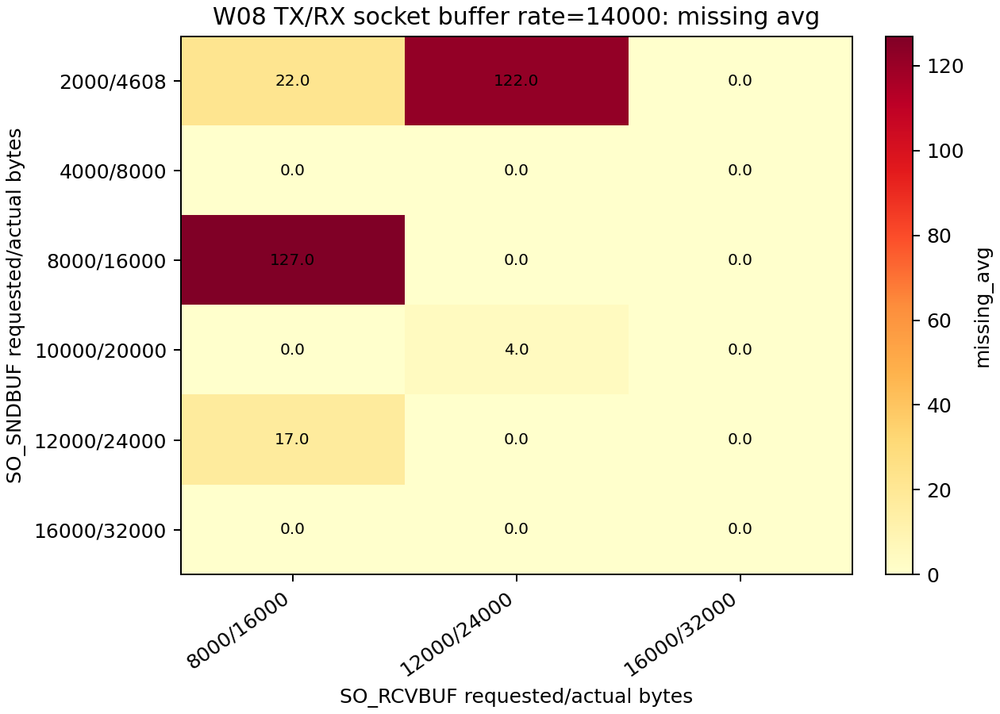
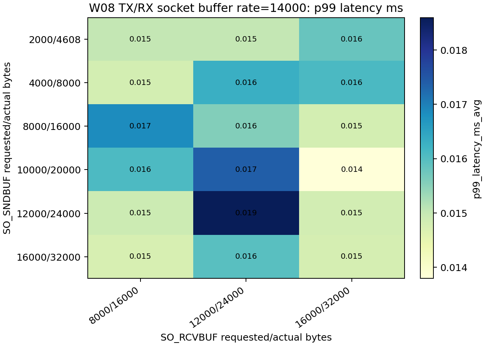
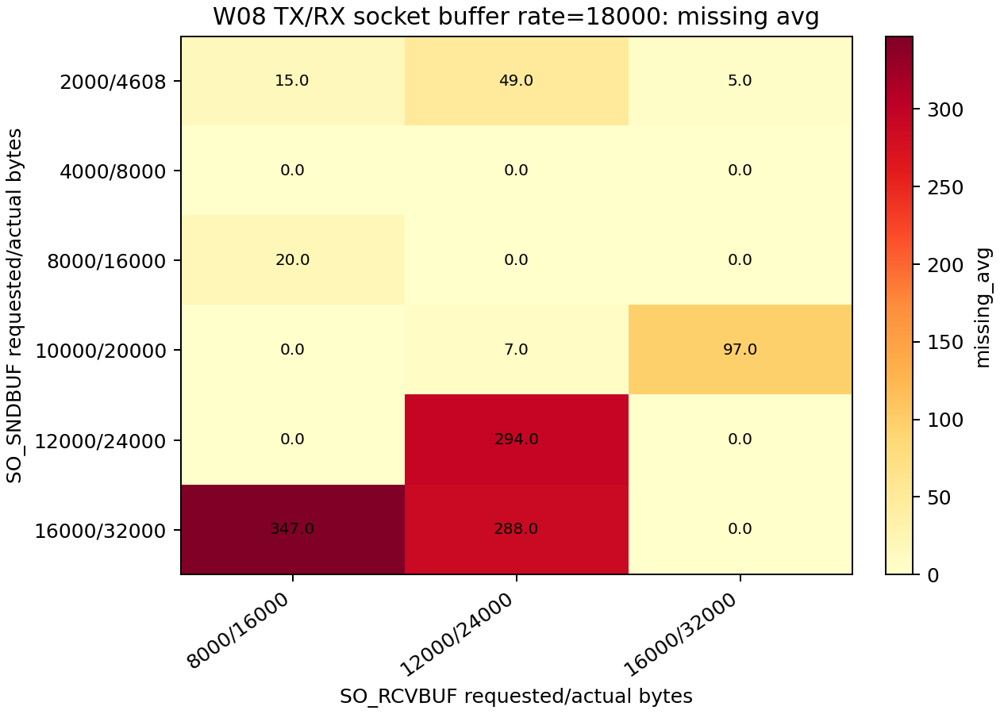
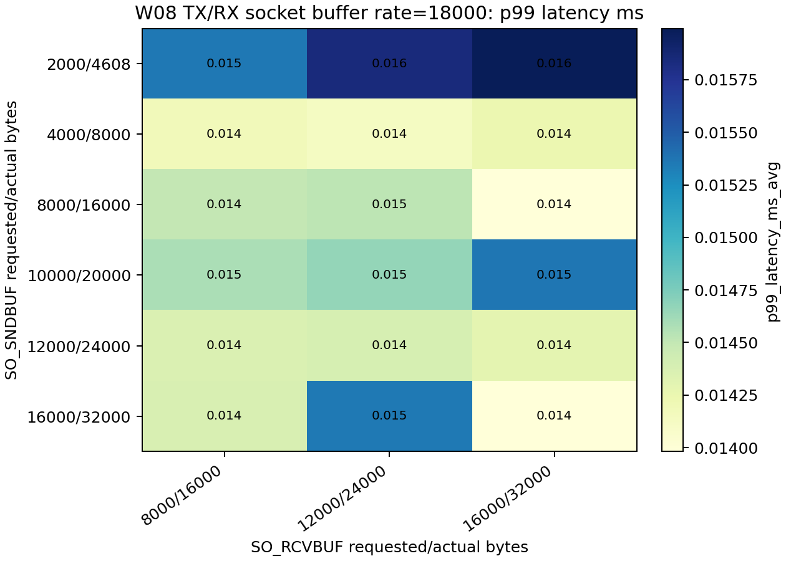

# W08 #131 socket buffer matrix report

## 目的

- `SO_RCVBUF` の requested 値を変えたとき、UDP loopback の `missing_delta_total` と latency がどう変わるかを確認する。
- #130 の `rate_hz=14000` 付近で見えた missing 増大が、受信 socket buffer の小ささで説明できるかを切り分ける。

## 結論

- #131 全体では 300 runs を確認し、すべて `run_validity=ok`。内訳は受信buffer sweep 192 runs、送受信buffer matrix 108 runs。
- `SO_RCVBUF` の actual は requested と一致しない。最小側では `100 / 512 / 1024` がすべて `actual=2304` に丸められ、大きい側では `262144` 以上が `actual=425984` の天井に丸められた。
- missing は socket buffer size と単調には対応しなかった。`actual=2304` まで小さくしても #130 の大きな missing は再現していない。
- 送信bufferも組み合わせた tx/rx matrix では、`rate_hz=18000` で missing が増える条件があり、送信bufferと受信bufferの組み合わせ依存が見えた。
- #131 内で最も missing が大きい集計条件は `rate_hz=10000, requested=65536, actual=131072` の `missing_avg=40.0`。ただしこれは重複条件6 trialsの平均で、同じ buffer size だから必ず悪い、とは言えない。
- p99 latency は全体として狭い範囲に収まった。最小は `0.013271 ms`、最大は `0.019710 ms` 程度で、buffer size による大きな改善・悪化は確認できない。
- max latency は外れ値の影響を受ける。最大の集計条件は `rate_hz=10000, requested=65536, actual=131072` の `max_latency_ms_avg=12.709301 ms`。平均・p99と分けて扱う必要がある。
- 実用上の安定候補は、missing が概ね出ず actual も天井に張り付かない `requested=16384(actual=32768)` 以上。ただし #131 の結果だけでは最適値を一意には決めない。

## 実験セット

| set | runs | invalid |
| --- | ---: | ---: |
| large matrix | 108 | 0 |
| lowbuf matrix | 54 | 0 |
| tiny sweep | 30 | 0 |
| tx/rx matrix | 108 | 0 |

- 共通条件: loopback `127.0.0.1:9000`, payload_len `48`, tx 10 sec, rx 12 sec, recovery_mode `fsm`, CPU affinity none, SO_SNDBUF default
- rate_hz: `10000 / 12000 / 14000 / 16000 / 18000 / 20000`
- tx/rx matrix: rate_hz `14000 / 18000`, SO_RCVBUF `8000 / 12000 / 16000`, SO_SNDBUF `2000 / 4000 / 8000 / 10000 / 12000 / 16000`
- heatmap / 差分表では、actual が `425984` に丸められた列を代表 `262144/425984` の1列に圧縮した。

## requested と actual の事実

`SO_RCVBUF` は requested 値がそのまま使われない。今回観測した対応は以下。

| requested | actual |
| ---: | ---: |
| 100 | 2304 |
| 512 | 2304 |
| 1024 | 2304 |
| 4096 | 8192 |
| 8000 | 16000 |
| 8192 | 16384 |
| 16384 | 32768 |
| 32768 | 65536 |
| 49152 | 98304 |
| 65536 | 131072 |
| 98304 | 196608 |
| 262144 | 425984 |
| 1048576 | 425984 |
| 4194304 | 425984 |
| 8388608 | 425984 |
| 16777216 | 425984 |

差分として重要なのは以下。

- `100 / 512 / 1024` はすべて `actual=2304`。これより細かい requested の違いは、今回の環境では actual buffer 差になっていない。
- `4096` 以上は概ね2倍の actual になった。
- `262144` 以上は `actual=425984` に丸められたため、巨大な requested 値同士の比較は実質同じ buffer size の比較になる。

## missing に関する事実と差

- heatmap集計後の条件数は 37。このうち `missing_avg=0` は 27 条件、非ゼロは 10 条件。
- `missing_avg` は同一条件の trial における `missing_delta_total` の平均。packet数ではなく、seq の飛びから見た frame 欠落数。
- 非ゼロ条件の上位は以下。

| rate_hz | requested/actual | trials | missing_avg | p99_ms | max_ms |
| ---: | ---: | ---: | ---: | ---: | ---: |
| 10000 | 65536/131072 | 6 | 40.0 | 0.016904 | 12.709300 |
| 14000 | 8192/16384 | 3 | 35.0 | 0.016944 | 4.247707 |
| 14000 | 1024/2304 | 3 | 28.0 | 0.013271 | 1.936266 |
| 10000 | 8192/16384 | 3 | 22.0 | 0.014975 | 4.047403 |
| 14000 | 100/2304 | 3 | 21.0 | 0.016234 | 1.777476 |
| 10000 | 1024/2304 | 3 | 11.0 | 0.015531 | 1.525907 |
| 14000 | 8000/16000 | 3 | 7.0 | 0.014759 | 2.033836 |
| 18000 | 8192/16384 | 3 | 6.0 | 0.014549 | 2.059567 |
| 10000 | 100/2304 | 3 | 3.0 | 0.015086 | 0.660421 |
| 14000 | 512/2304 | 3 | 3.0 | 0.016339 | 0.556144 |

missing の差分として言えること:

- 最小 actual `2304` でも missing は小さい。`rate_hz=14000` では `requested=100/512/1024` の missing_avg は `21.0 / 3.0 / 28.0`。#130 の大きな missing を説明する規模ではない。
- `requested=4096(actual=8192)` は `rate_hz=10000/14000` ともに `missing_avg=0.0`。
- `requested=8192(actual=16384)` は `rate_hz=10000/14000/18000` で `22.0 / 35.0 / 6.0` と少量の missing が出た。
- `requested=16384(actual=32768)` 以上では、今回の lowbuf matrix 範囲では missing は基本的に 0。ただし重複して実施した `requested=65536(actual=131072)` の `rate_hz=10000` では外れ値を含み、統合平均で `40.0` になった。
- よって missing は buffer size だけで単調に説明できず、run の揺らぎやスケジューリングの影響を含む。

## latency に関する事実と差

p99 latency の下位・上位は以下。

### p99 latency が小さい条件

| rate_hz | requested/actual | p99_ms | missing_avg |
| ---: | ---: | ---: | ---: |
| 14000 | 1024/2304 | 0.013271 | 28.0 |
| 14000 | 98304/196608 | 0.014241 | 0.0 |
| 18000 | 262144/425984 | 0.014454 | 0.0 |
| 18000 | 8192/16384 | 0.014549 | 6.0 |
| 18000 | 16384/32768 | 0.014691 | 0.0 |
| 20000 | 65536/131072 | 0.014759 | 0.0 |
| 14000 | 8000/16000 | 0.014759 | 7.0 |
| 10000 | 512/2304 | 0.014907 | 0.0 |

### p99 latency が大きい条件

| rate_hz | requested/actual | p99_ms | missing_avg |
| ---: | ---: | ---: | ---: |
| 18000 | 49152/98304 | 0.019710 | 0.0 |
| 14000 | 49152/98304 | 0.019056 | 0.0 |
| 10000 | 16384/32768 | 0.018574 | 0.0 |
| 18000 | 65536/131072 | 0.018340 | 0.0 |
| 10000 | 49152/98304 | 0.017969 | 0.0 |
| 10000 | 98304/196608 | 0.017839 | 0.0 |
| 18000 | 98304/196608 | 0.017679 | 0.0 |
| 10000 | 262144/425984 | 0.017398 | 0.0 |

latency の差分として言えること:

- p99 latency はおおむね `0.013〜0.020 ms` の範囲で、buffer size による大きな差は出ていない。
- p99 が最大の条件は `rate_hz=18000, requested=49152(actual=98304)` の `0.019710 ms` だが、missing は `0.0`。latency と missing は同じ方向に動いていない。
- p99 が小さい条件にも `requested=1024(actual=2304)` が含まれる。小さい buffer が必ず latency を悪化させるとは言えない。
- mean latency は一部 outlier 条件を除くと概ね `0.011〜0.016 ms` 程度。`rate_hz=10000, requested=65536(actual=131072)` は `mean=0.045243 ms` まで上がっており、外れ値の影響が強い。

## max latency / outlier

max latency は外れ値の影響を受けるため、p99とは分けて評価する。上位は以下。

| rate_hz | requested/actual | max_ms | mean_ms | p99_ms | missing_avg |
| ---: | ---: | ---: | ---: | ---: | ---: |
| 10000 | 65536/131072 | 12.709300 | 0.045243 | 0.016904 | 40.0 |
| 14000 | 8192/16384 | 4.247707 | 0.014108 | 0.016944 | 35.0 |
| 10000 | 8192/16384 | 4.047403 | 0.012975 | 0.014975 | 22.0 |
| 18000 | 32768/65536 | 3.913160 | 0.014085 | 0.015352 | 0.0 |
| 14000 | 16384/32768 | 3.217655 | 0.012354 | 0.015531 | 0.0 |
| 10000 | 32768/65536 | 2.775619 | 0.015212 | 0.017327 | 0.0 |
| 16000 | 65536/131072 | 2.718029 | 0.011672 | 0.016704 | 0.0 |
| 18000 | 262144/425984 | 2.654632 | 0.013649 | 0.014454 | 0.0 |

- `rate_hz=10000, requested=65536(actual=131072)` は missing と max latency の両方が大きく、今回の外れ値条件。
- ただし他の max latency 上位には missing 0 の条件も多い。tail latency と missing は別指標として扱う。

## heatmaps

actual が kernel 上限 `425984` に丸められた列は、代表として `262144/425984` の1列に圧縮した。

- missing average heatmap: `reports/figures/w08_socket_buffer_heatmap_missing_avg.png`
- p99 latency heatmap: `reports/figures/w08_socket_buffer_heatmap_p99_latency_ms.png`
- mean latency heatmap: `reports/figures/w08_socket_buffer_heatmap_mean_latency_ms.png`
- heatmap source summary: `reports/w08_socket_buffer_heatmap_summary.csv`

## TX/RX buffer matrix に関する追加結果

追加で、送信側 `SO_SNDBUF` と受信側 `SO_RCVBUF` を同時に変えた matrix を実施した。

- total runs: 108
- run_validity=ok: 108
- rate_hz: `14000 / 18000`
- SO_RCVBUF requested/actual: `8000/16000`, `12000/24000`, `16000/32000`
- SO_SNDBUF requested/actual: `2000/4608`, `4000/8000`, `8000/16000`, `10000/20000`, `12000/24000`, `16000/32000`

### TX/RX matrix: missing の事実と差

missing 上位は以下。

| rate_hz | rcv requested/actual | snd requested/actual | trials | missing_avg | p99_ms | max_ms |
| ---: | ---: | ---: | ---: | ---: | ---: | ---: |
| 18000 | 8000/16000 | 16000/32000 | 3 | 347.0 | 0.014370 | 21.121339 |
| 18000 | 12000/24000 | 12000/24000 | 3 | 294.0 | 0.014383 | 17.988513 |
| 18000 | 12000/24000 | 16000/32000 | 3 | 288.0 | 0.015352 | 17.631617 |
| 14000 | 8000/16000 | 8000/16000 | 3 | 127.0 | 0.016840 | 37.583350 |
| 14000 | 12000/24000 | 2000/4608 | 3 | 122.0 | 0.015031 | 20.102280 |
| 18000 | 16000/32000 | 10000/20000 | 3 | 97.0 | 0.015370 | 7.857550 |
| 18000 | 12000/24000 | 2000/4608 | 3 | 49.0 | 0.015839 | 5.587120 |
| 14000 | 8000/16000 | 2000/4608 | 3 | 22.0 | 0.015018 | 5.948824 |

missing の差分として言えること:

- 受信bufferだけの sweep では #130 の missing 増大を再現しなかったが、送信bufferも組み合わせると missing が増える条件が出た。
- 特に `rate_hz=18000` では、`rcvbuf=8000/16000` と `sndbuf=16000/32000` の組み合わせで `missing_avg=347.0` と大きい。
- 同じ `rate_hz=18000` でも全条件が悪いわけではないため、rate だけ・buffer単体だけでは説明できない。
- `SO_SNDBUF` が大きいほど常に良い、または小さいほど常に良い、という単調な傾向は確認できない。

### TX/RX matrix: latency の事実と差

p99 latency 上位は以下。

| rate_hz | rcv requested/actual | snd requested/actual | trials | p99_ms | missing_avg | max_ms |
| ---: | ---: | ---: | ---: | ---: | ---: | ---: |
| 14000 | 12000/24000 | 12000/24000 | 3 | 0.018599 | 0.0 | 1.611274 |
| 14000 | 12000/24000 | 10000/20000 | 3 | 0.017389 | 4.0 | 3.125295 |
| 14000 | 8000/16000 | 8000/16000 | 3 | 0.016840 | 127.0 | 37.583350 |
| 14000 | 12000/24000 | 4000/8000 | 3 | 0.016302 | 0.0 | 1.815472 |
| 14000 | 16000/32000 | 4000/8000 | 3 | 0.016099 | 0.0 | 0.177025 |
| 14000 | 8000/16000 | 10000/20000 | 3 | 0.016074 | 0.0 | 0.089710 |
| 18000 | 16000/32000 | 2000/4608 | 3 | 0.015994 | 5.0 | 2.869030 |
| 14000 | 12000/24000 | 16000/32000 | 3 | 0.015963 | 0.0 | 0.289074 |

latency の差分として言えること:

- p99 latency は TX/RX matrix でも概ね `0.014〜0.019 ms` の範囲で、missing の増減ほど大きくは動いていない。
- missing 最大条件 `18000, rcv=8000/16000, snd=16000/32000` の p99 は `0.014370 ms` で、p99 latency 上位ではない。
- 一方、p99 最大条件 `14000, rcv=12000/24000, snd=12000/24000` は `missing_avg=0.0`。missing と p99 latency は同じ方向に動かない。
- max latency は missing が大きい条件で跳ねることがあり、tail/outlier は p99 とは別に見る必要がある。

### TX/RX matrix heatmaps

縦軸は `SO_SNDBUF requested/actual`、横軸は `SO_RCVBUF requested/actual`。

## #131 の判断

- #130 の missing 増大は、受信buffer単体 sweep では再現しなかった。一方で TX/RX buffer matrix では missing が増える組み合わせがあり、buffer size 単独ではなく送信側・受信側・rate の組み合わせ依存として扱う。
- `SO_RCVBUF` を極端に大きくしても actual が天井に張り付くため、巨大値を細かく比較する意味は薄い。
- `requested=16384(actual=32768)` 以上を安定候補とし、それ以上の調整は performance 本命Issueで CPU affinity / rate / OS scheduling と合わせて評価する。

## 成果物

- 実行スクリプト: `scripts/w08/run_socket_buffer_matrix.sh`
- 追加実行スクリプト: `scripts/w08/run_socket_buffer_tiny_sweep.sh`
- 集計スクリプト: `scripts/analyze_w08_socket_buffer_matrix.py`
- heatmap生成スクリプト: `scripts/analyze_w08_socket_buffer_heatmaps.py`
- 単一レポート: `reports/w08_socket_buffer_matrix_summary.md`
- heatmap集計CSV: `reports/w08_socket_buffer_heatmap_summary.csv`
- raw/summary data: `data/w08/socket_buffer_matrix/`, `data/w08/socket_buffer_matrix_lowbuf/`, `data/w08/socket_buffer_tiny/`, `data/w08/socket_buffer_txrx_matrix/`
- TX/RX matrix summary CSV: `reports/w08_socket_buffer_txrx_matrix_summary.csv`, `reports/w08_socket_buffer_txrx_matrix_aggregate_summary.csv`
