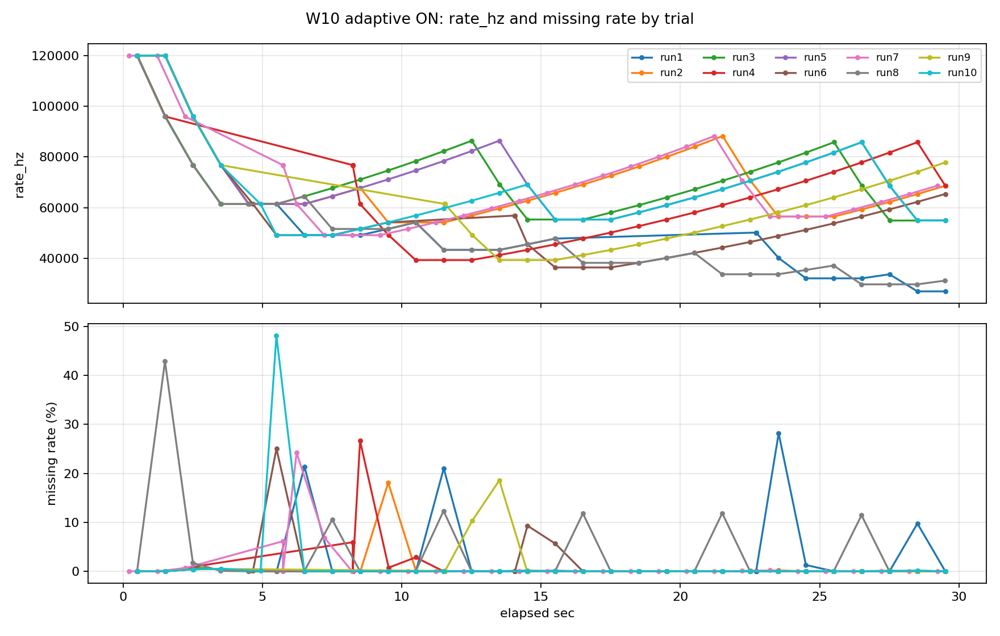
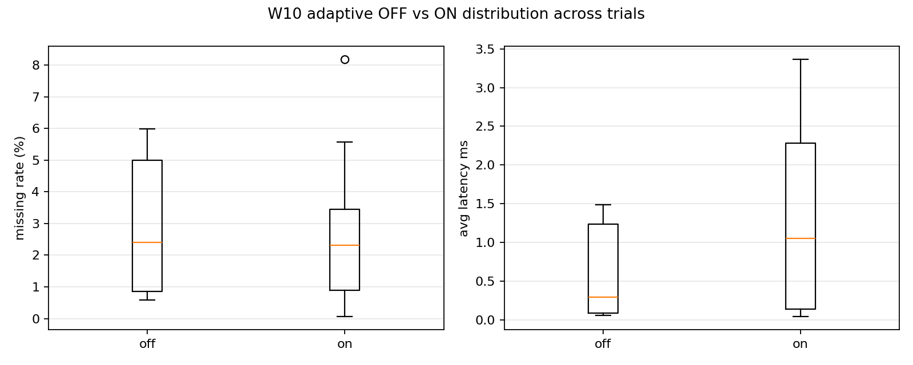
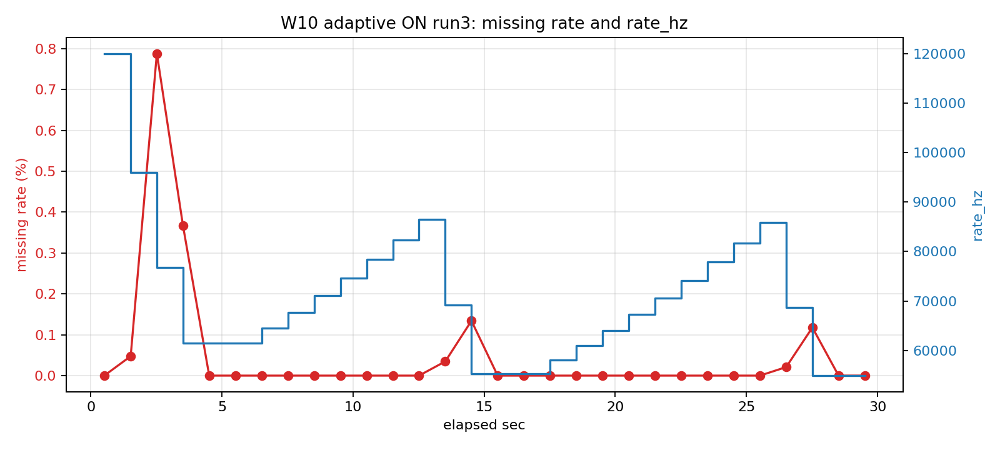
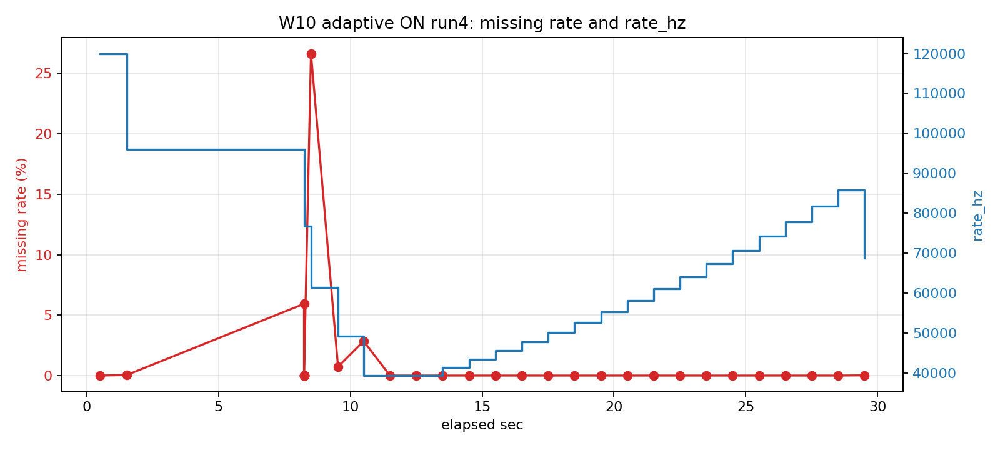
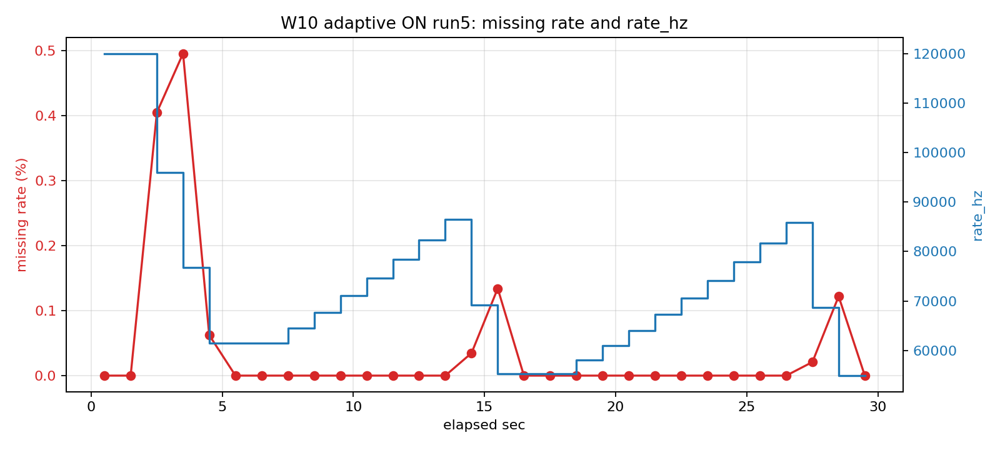
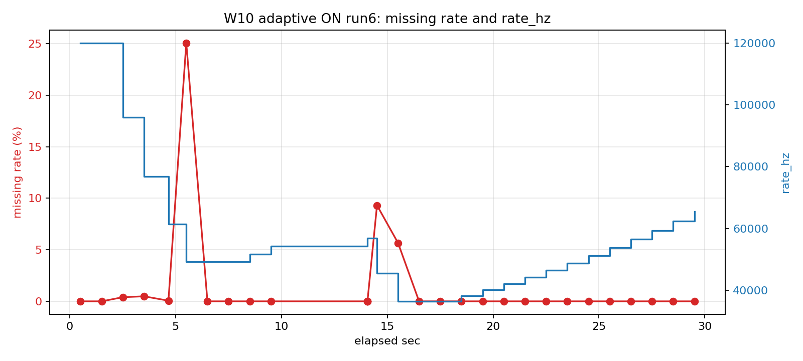
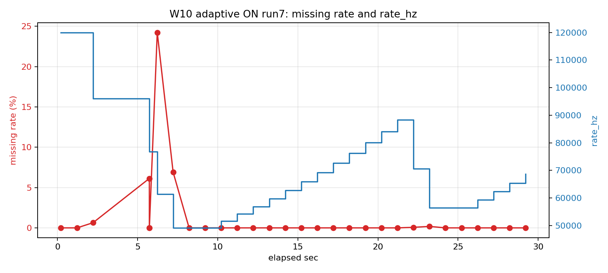
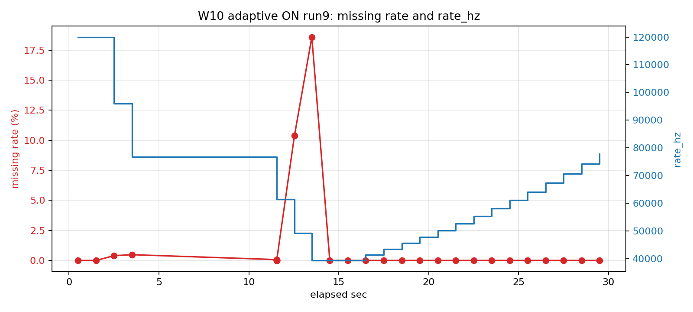
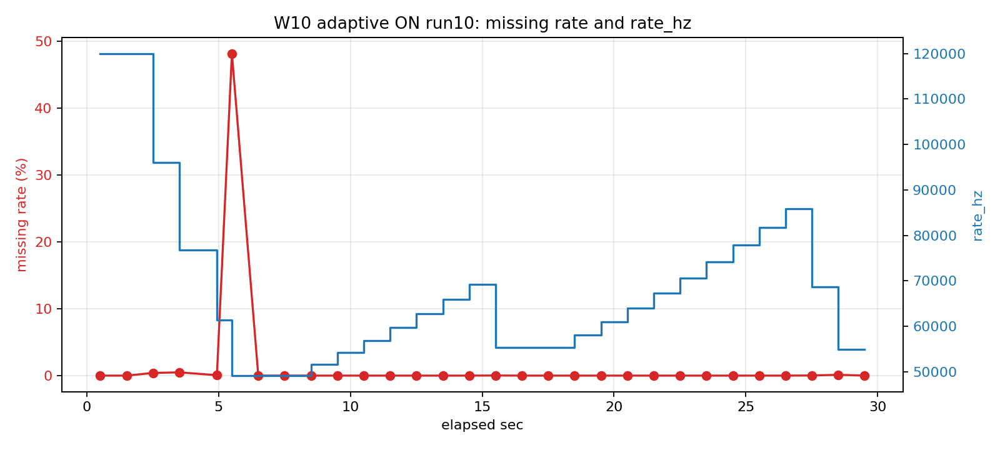

# W10 adaptive rate comparison summary

## 実験条件

- host: Raspberry Pi 5 loopback
- rx core: 2
- tx core: 3
- initial rate_hz: 120000
- tx duration: 30 sec
- rx duration: 32 sec
- adaptive_min_rate_hz: 1000
- adaptive_max_rate_hz: 500000
- adaptive_high_latency_ms: 0
- trials: off/on 各10回

## 結論

- OFF は rate_hz=120000 固定。10試行平均の missing rate は 2.8919%、中央値は 2.3979%。
- ON は missing 検出で rate_hz を下げた。10試行平均の最終 rate_hz は 57232、中央値は 60172。
- ON 全10試行平均の missing rate は 2.7661%、中央値は 2.3070%。平均・中央値とも OFF より低い。
- ON は 3/10 試行で missing rate < 1% に収まった。安定試行平均は 0.2497%。
- ON の外れ試行は 7/10 試行で、対象は run1(8.1942%), run4(2.1432%), run6(2.4709%), run7(3.4488%), run8(5.5732%), run9(3.4365%), run10(1.6455%)。
- latency は全10試行の中央値ベースでは ON が悪い。avg latency median は OFF 0.292 ms、ON 1.052 ms。
- CPU 使用率も ON が低い。avg cpu pct は OFF 31.00%、ON 18.18%。
- したがって追加10試行では、adaptive ON は missing と CPU では小幅に改善したが、latency は悪化している。安定試行だけを見ると良いが、外れ試行が多く、現状は制御方針の有効性は見えるが完成度は不足。
- 残課題は外れ試行の抑制。初期 decrease の強さ、missing spike 後の recovery、feedback window の安定判定を調整する余地がある。

## ON/OFF 集計比較

| mode | 対象 | trials | missing rate avg | missing rate median | avg latency ms avg | avg latency ms median | p99 latency ms avg | max latency ms avg | avg cpu pct | final rate avg |
|---|---|---:|---:|---:|---:|---:|---:|---:|---:|---:|
| off | run1-10 | 10 | 2.8919% | 2.3979% | 0.610 | 0.292 | 0.012 | 2362.021 | 31.00 | 120000 |
| on | run1-10 | 10 | 2.7661% | 2.3070% | 1.276 | 1.052 | 0.072 | 2975.857 | 18.18 | 57232 |
| on | missing<1%のみ | 3 | 0.2497% | 0.0615% | 0.069 | 0.040 | 0.014 | 105.940 | 22.01 | 59516 |

## run別詳細

| mode | trial | ok frames | missing frames | missing rate | avg latency ms | p99 latency ms | max latency ms | avg cpu pct | start rate | final rate | min rate | max rate | dec/inc/hold |
|---|---:|---:|---:|---:|---:|---:|---:|---:|---:|---:|---:|---:|---:|
| off | 1 | 3517962 | 82035 | 2.2788% | 0.155 | 0.011 | 147.718 | 33.37 | 120000 | 120000 | 120000 | 120000 | 0/0/30 |
| off | 2 | 3577896 | 22101 | 0.6139% | 0.060 | 0.010 | 12.249 | 34.80 | 120000 | 120000 | 120000 | 120000 | 0/0/30 |
| off | 3 | 3577863 | 22134 | 0.6148% | 0.060 | 0.011 | 11.672 | 34.98 | 120000 | 120000 | 120000 | 120000 | 0/0/30 |
| off | 4 | 3579003 | 20994 | 0.5832% | 0.058 | 0.011 | 12.024 | 33.80 | 120000 | 120000 | 120000 | 120000 | 0/0/30 |
| off | 5 | 3509385 | 90612 | 2.5170% | 0.170 | 0.009 | 168.943 | 32.04 | 120000 | 120000 | 120000 | 120000 | 0/0/30 |
| off | 6 | 3472455 | 127542 | 3.5428% | 1.280 | 0.013 | 6376.202 | 27.91 | 120000 | 120000 | 120000 | 120000 | 0/0/30 |
| off | 7 | 3543564 | 56433 | 1.5676% | 0.414 | 0.013 | 1919.482 | 30.34 | 120000 | 120000 | 120000 | 120000 | 0/0/30 |
| off | 8 | 3393978 | 206019 | 5.7228% | 1.319 | 0.014 | 4667.421 | 27.66 | 120000 | 120000 | 120000 | 120000 | 0/0/30 |
| off | 9 | 3402447 | 197550 | 5.4875% | 1.096 | 0.014 | 4788.481 | 28.22 | 120000 | 120000 | 120000 | 120000 | 0/0/30 |
| off | 10 | 3384318 | 215679 | 5.9911% | 1.486 | 0.013 | 5516.020 | 26.90 | 120000 | 120000 | 120000 | 120000 | 0/0/30 |
| on | 1 | 1500414 | 133920 | 8.1942% | 3.368 | 0.390 | 6651.496 | 13.35 | 120000 | 26979 | 26979 | 120000 | 8/6/16 |
| on | 2 | 2116620 | 13452 | 0.6315% | 0.128 | 0.017 | 296.904 | 21.19 | 120000 | 68674 | 54190 | 120000 | 6/16/8 |
| on | 3 | 2144061 | 1320 | 0.0615% | 0.040 | 0.013 | 11.599 | 22.67 | 120000 | 54937 | 54937 | 120000 | 7/16/7 |
| on | 4 | 1847313 | 40458 | 2.1432% | 2.423 | 0.012 | 6611.555 | 17.11 | 120000 | 68675 | 39321 | 120000 | 6/16/8 |
| on | 5 | 2208477 | 1236 | 0.0559% | 0.039 | 0.012 | 9.317 | 22.18 | 120000 | 54937 | 54937 | 120000 | 7/16/7 |
| on | 6 | 1692693 | 42885 | 2.4709% | 1.851 | 0.013 | 4405.169 | 15.42 | 120000 | 65405 | 36416 | 120000 | 6/15/9 |
| on | 7 | 2019408 | 72132 | 3.4488% | 1.160 | 0.017 | 3398.599 | 19.78 | 120000 | 68675 | 49152 | 120000 | 6/16/8 |
| on | 8 | 1426710 | 84207 | 5.5732% | 0.945 | 0.225 | 788.037 | 13.50 | 120000 | 31233 | 29745 | 120000 | 8/9/13 |
| on | 9 | 1838802 | 65439 | 3.4365% | 2.626 | 0.011 | 7149.171 | 16.15 | 120000 | 77862 | 39321 | 120000 | 5/14/11 |
| on | 10 | 2032671 | 34008 | 1.6455% | 0.177 | 0.012 | 436.721 | 20.49 | 120000 | 54939 | 49152 | 120000 | 7/16/7 |

## adaptive ON 時系列グラフ

missing rate は adaptive feedback window ごとの値。rate_hz は tx が次に使う送信 rate。

## 生成物

- run summary CSV: `reports/w10_adaptive_rate_run_summary.csv`
- report: `reports/w10_adaptive_rate_summary.md`
- figures: `reports/figures/w10_adaptive_on_*.png`, `reports/figures/w10_adaptive_off_on_boxplot.png`
